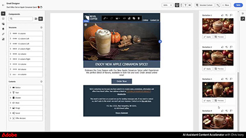

# Lesbestanden voor Journey Optimizer

Journey Optimizer stelt bedrijven in staat samenhangende, contextuele en persoonlijke klantervaringen te maken. Het leidt klanten naadloos door hun volledige reis met het merk, van het eerste contactpunt tot het ogenblik dat zij de plaats verlaten, die een verbonden en bevredigende ervaring op elk aanraakpunt verzekeren.

Deze gebruikershandleiding bevat video&#39;s en zelfstudies over de functies en mogelijkheden van Adobe Journey Optimizer. Praktijk wat u door de [ Uitdagingen van Journey Optimizer ](https://experienceleague.adobe.com/en/docs/journey-optimizer-learn/challenges/introduction-and-prerequisites) te nemen hebt geleerd.

## Nieuwste Experience League Live-gebeurtenissen

<!-- CARDS
* https://experienceleague.adobe.com/en/docs/events/experience-league-live-recordings/episodes/exl-live-episode-06-18-25
  {title = Master Frequency Capping & Conflict Prioritization (June 18, 2025)}
  {description = In this session, Adobe experts Ariel Sultan and Aaron Forrest dove into new features in Adobe Journey Optimizer to help you govern and prioritize customer messages with precision. They showed how to reduce messaging fatigue, resolve conflicts, and deliver impactful experiences that resonate. }
* https://experienceleague.adobe.com/en/docs/events/experience-league-live-recordings/episodes/exl-live-episode-40-2024-10-24
     {title = Agile Workflows for Personalized Content at Scale (June 05, 2025)}
     {description = In this session, Adobe experts Chris Ivory, Amarnath Vannarath, and Rohan Bhatt showcase how Adobe Journey Optimizer (AJO) seamlessly integrates with Adobe Express and GenStudio for Performance Marketing. Learn how these tools bring unparalleled flexibility, collaboration, and AI-powered creativity to your marketing workflows.}
* https://experienceleague.adobe.com/en/docs/events/experience-league-live-recordings/episodes/exl-live-episode-02-27-25
     {title = Unlocking operational insights with AI Assistant in Adobe Experience Platform (February 27, 2025)}
     {description = ur experts discussed how AI Assistant can unlock valuable operational insights, boosting productivity and redefining work in Adobe Experience Platform and its platform-based applications.}

-->
<!-- START CARDS HTML - DO NOT MODIFY BY HAND -->

    

        

            

                <figure class="image x-is-16by9">
                    
                </figure>
            

            

                

                    

                        <a href="https://experienceleague.adobe.com/en/docs/events/experience-league-live-recordings/episodes/exl-live-episode-06-18-25" target="_blank" rel="referrer" title="Hoofdfrequentiecapping en conflictoplossing (18 juni 2025)"> HoofdFrequentieCapping &amp; Prioritization van het Conflict (18 Juni, 2025) </a>
                    

                    
In deze sessie gaan Adobe-experts Ariel Sultan en Aaron Forrest over nieuwe functies in Adobe Journey Optimizer om u te helpen bij het nauwkeurig beheren en prioriteren van klantberichten. Zij toonden hoe te om overseinenvermoeidheid te verminderen, conflicten op te lossen, en impactful ervaringen te leveren die resoneren.

                

                <a href="https://experienceleague.adobe.com/en/docs/events/experience-league-live-recordings/episodes/exl-live-episode-06-18-25" target="_blank" rel="referrer" class="spectrum-Button spectrum-Button--outline spectrum-Button--primary spectrum-Button--sizeM" style="align-self: flex-start; margin-top: 1rem;">
                     Controle 
                </a>
            

        

    

    

        

            

                <figure class="image x-is-16by9">
                    
                </figure>
            

            

                

                    

                        <a href="https://experienceleague.adobe.com/en/docs/events/experience-league-live-recordings/episodes/exl-live-episode-40-2024-10-24" target="_blank" rel="referrer" title="Gelijke workflows voor persoonlijke inhoud op schaal (5 juni 2025)"> Gelijke Workflows voor Gepersonaliseerde Inhoud op Schaal (05 Juni, 2025) </a>
                    

                    
In deze sessie tonen Adobe-experts Chris Ivory, Amarnath Vannarath en Rohan Bhatt aan hoe Adobe Journey Optimizer (AJO) naadloos kan integreren met Adobe Express en GenStudio for Performance Marketing. Leer hoe deze hulpmiddelen ongeëvenaarde flexibiliteit, samenwerking, en AI-aangedreven creativiteit aan uw marketing werkschema's brengen.

                

                <a href="https://experienceleague.adobe.com/en/docs/events/experience-league-live-recordings/episodes/exl-live-episode-40-2024-10-24" target="_blank" rel="referrer" class="spectrum-Button spectrum-Button--outline spectrum-Button--primary spectrum-Button--sizeM" style="align-self: flex-start; margin-top: 1rem;">
                     Controle 
                </a>
            

        

    

    

        

            

                <figure class="image x-is-16by9">
                    
                </figure>
            

            

                

                    

                        <a href="https://experienceleague.adobe.com/en/docs/events/experience-league-live-recordings/episodes/exl-live-episode-02-27-25" target="_blank" rel="referrer" title="De operationele inzichten met AI Assistant in Adobe Experience Platform ontgrendelen (27 februari 2025)"> het Ontgrendelen van operationele inzichten met AI Medewerker in Adobe Experience Platform (27 Februari, 2025) </a>
                    

                    
Onze experts hebben besproken hoe AI Assistant waardevolle operationele inzichten kan ontsluiten, de productiviteit kan verhogen en het werk in Adobe Experience Platform en zijn platformgebaseerde toepassingen opnieuw kan definiëren.

                

                <a href="https://experienceleague.adobe.com/en/docs/events/experience-league-live-recordings/episodes/exl-live-episode-02-27-25" target="_blank" rel="referrer" class="spectrum-Button spectrum-Button--outline spectrum-Button--primary spectrum-Button--sizeM" style="align-self: flex-start; margin-top: 1rem;">
                     Controle 
                </a>
            

        

    

<!-- END CARDS HTML - DO NOT MODIFY BY HAND -->

## Personeelsselectie

<table>
<tr>
    <td>
    
    

      <a href="../content-management/create-content-using-ai-assistant-for-content-generation.md">
    <strong> creeer inhoud gebruikend AI Medewerker voor inhoudsgeneratie </strong>
    </a>
    

    

    <em> Leer hoe te om AI Medewerker voor inhoudsgeneratie te gebruiken om pro-actieve suggesties van de inhoudsvariatie voor zowel tekst als beelden te produceren.
</em>
    

  </td>
    <td>
    
    

      <a href="../experimentation/content-experiments-for-emails.md">
    <strong> Vorm inhoudexperimenten voor e-mailcampagnes </strong>
    </a>
    

    

    <em> Leer hoe te om inhoudsexperimenten aan A/B test te vormen en e-mailinhoud te onderzoeken beste drijft uw bedrijfsdoelstellingen.</em>
    

  </td>
  </td>
    <td>
    
    

      <a href="../decision-management/create-decisions.md">
    <strong>Inleiding tot de mogelijkheden voor beslissingsbeheer </strong>
    </a>
    

    

    <em>De video behandelt de zakelijke problemen die worden opgelost door de mogelijkheden van beslissingsbeheer, wat de belangrijkste mogelijkheden zijn, de basisarchitectuur en de belangrijkste gebruiksscenario's.

</em>
    

  </td>
</tr>
<tr>
  <td>
    
    

      <a href="../create-journeys/use-case-transactional-journey.md">
    <strong>Gebruiksscenario - Transactionele journey </strong>
    </a>
    

    

    <em>Begrijp de toepasselijke gebruiksscenario's voor transactionele journeys. Leer hoe u transactionele journeys bouwt en welke aanbevolen procedures u kunt toepassen.</em>
    

  </td>
    <td>
    
    

      <a href="../personalize-content/use-contextual-event-information-for-personalization.md">
    <strong>Contextuele gebeurtenisinformatie gebruiken voor personalisatie </strong>
    </a>
    

    

    <em>Leer hoe u contextuele gebeurtenisinformatie van een journey kunt gebruiken om een bericht te personaliseren.</em>
    

  </td>
  </td>
    <td>
    
    

      <a href="../report-and-monitor/live-and-global-reports.md">
    <strong>Live en globale rapporten </strong>
    </a>
    

    

    <em>Leer het verschil tussen live en wereldwijde rapporten, hoe u de journey- en berichtspecifieke rapporten kunt openen en analyseren en hoe u de rapportdashboards kunt wijzigen.

</em>
    

  </td>
</tr>
</table>

