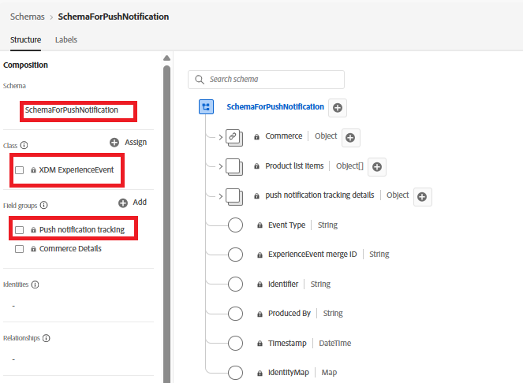

# DataStream maken

Een gegevensstroom in Adobe Experience Platform (AEP) doet dienst als eindpunt dat gegevens ontvangt die van het Web SDK worden verzonden. Het leidt deze gegevens aan de gevormde diensten zoals AEP, Adobe Analytics, of Adobe Journey Optimizer. In deze zelfstudie wordt de datastream gebruikt om abonnementsgegevens en price.drop-gebeurtenissen voor webpush naar AEP te verzenden voor activering.

## Gebeurtenisschema maken voor het bijhouden van pushberichten

Maak een nieuw XDM ExperienceEvent-schema met de naam `SchemaForPushNotification` . Voeg de `Push Notification Tracking` - en `Commerce Details` -veldgroepen toe aan dit schema. De velden van de veldgroep Commerce Details worden gebruikt om productinformatie vast te leggen en de gebeurtenis custom price.drop te activeren.

## Profielschema maken om toestemming van de gebruiker op te slaan

Voor deze zelfstudie gebruiken we de uit-van-de-doos `AJO Push Profile Schema` . In dit schema worden de gegevens van het pushabonnement van de gebruiker opgeslagen, inclusief het pushtoken dat is vereist voor het verzenden van pushberichten via het web.

## Gegevenssets maken voor het schema

Maak een gegevensset met de naam `DataSetForPushNotification` met het eerder gemaakte gebeurtenisschema. Voor profielgegevens gebruikt u de uit-van-de-doos `AJO Push Profile Dataset`, die aan het schema van het duwprofiel wordt geassocieerd. Noteer de id van `DataSetForPushNotification` , zoals later in de zelfstudie wordt vereist wanneer u de toepassing configureert via het .env-bestand.

## Gegevensstroom maken met de gebeurtenis- en profielgegevensset

Creeer een nieuwe gegevensstroom genoemd WebPushDataStream gebruikend de gebeurtenis en profieldatasets die in de vorige stap worden gecreeerd. Noteer de DataStream-id, die later in de zelfstudie wordt vereist wanneer u de toepassing via het .env-bestand configureert.

