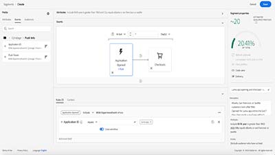
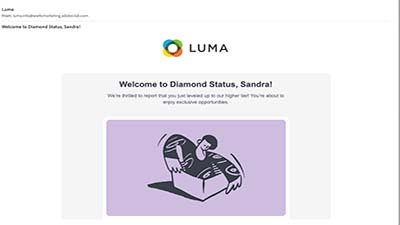

# Journey Optimizer-uitdagingen - Inleiding

De uitdagingen verstrekken een scenario en de vereisten nodig om te oefenen wat u leerde. De uitdagingen helpen u uw vaardigheidsniveau evalueren en kennishiaten identificeren.

Om de kennis en vaardigheden te ontwikkelen die nodig zijn voor de volgende uitdagingen, voltooit u de [Aan de slag met Journey Optimizer for Journey Managers en Beheerders](https://experienceleague.adobe.com/?recommended=JourneyOptimizer-U-1-2021.1) cursus.

## Het artikel

Luma, een fictioneel atletisch kledingbedrijf, wil zijn nieuwste kleding- en tandwielcollectie promoten en de verkoop voor bestaande klanten stimuleren. Luma gebruikt Adobe Journey Optimizer om verbonden, contextafhankelijke en persoonlijke ervaringen aan hun klanten te bieden.

U bent ingehuurd voor het implementeren van de marketing- en retentiecampagnes van Luma in Reis optimizer.

U zult drie uitdagingen moeten voltooien:
<table>
<tr>
<td>
  

      
      

  </td>
  <td>
   <a href="./create-segments-challenge.md">
    <strong>Uitdaging 1: 
 Segmenten maken </strong>
    </a>
      

      <em>Om specifieke klantensegmenten te richten en ervoor te zorgen dat de klanten de gepersonaliseerde productinformatie ontvangen, moet u segmenten creëren die in de klantenreizen worden gebruikt.</em>
      

    </td>
  </tr>
  <tr>
  <td>
  

    
  </td>
  <td>
      <a href="./create-segments-challenge.md">
    <strong>Uitdaging 2:
E-mailberichten maken en aanpassen </strong>
    </a>
    

    

    <em>Maak de persoonlijke e-mailberichten die Luma-klanten ontvangen wanneer ze met het merk communiceren of in het segment vallen dat met de marketingcampagne Luma is bedoeld.
    </em>
    

  </td>
  </tr>
  <tr>
    <td>
    

    
    

    <td>
    

      <a href="./create-journeys-challenge.md">
    <strong>Uitdaging 3:
Reizen maken </strong>
    </a>
    

    

    <em>Voer de klantenreizen van Luma voor de volgende gebruiksgevallen uit:
      <li>
      De nieuwe Luma-zomercollectie promoten
      </li> 
      <li>
      Een bevestigingsbericht voor bestellingen verzenden wanneer iemand een online aankoop heeft voltooid
      </li> 
      <li> 
      Verzend een e-mail wanneer een loyaliteitsklant naar een nieuwe rij beweegt om hen te feliciteren en te informeren over hun nieuwe voordelen
      </li> 
      <li>
      Klanten op de hoogte stellen wanneer een eerder uit voorraad bestaand item weer in voorraad is
      </li>
      </em>
    

  </td>
</table>

## Heb je alles wat je nodig hebt?

### Systeemvereisten

* Toegang tot een Journey Optimizer-instantie
* AEM Assets Essentials moet zijn ingericht voor uw exemplaar
* Het wordt aanbevolen de uitdaging in een specifieke trainingssandbox uit te voeren. Zie de [Zelfstudie voor een trainingssandbox instellen](/help/tutorial-set-up-training-sandbox/overview.md) voor instructies.
   * Zorg ervoor dat u een van beide *Reismanager* of *Reisbeheerder* rechten

### Vereiste acties

Voordat u aan de slag kunt gaan, moet u

1. [Een testprofiel maken](https://experienceleague.adobe.com/docs/journey-optimizer-learn/tutorials/create-journeys/test-a-journey.html?lang=en)
   1. Zoek op de startpagina van Journey Optimizer naar de gebruiksaanwijzing Testprofielen maken en voltooi deze om een testprofiel voor uzelf te maken.
   2. Gebruiken *E-mail* als naamruimte voor identiteit (gebruik uw e-mailadres voor zowel de velden Persoon-id als E-mailadres)
   3. U kunt desgewenst een adres voor de straat toevoegen (kolomkop: *straat1*) naar uw testprofiel.
2. [Alle Luma-elementen downloaden](/help/challenges/assets/email-assets/luma-assets.zip).
