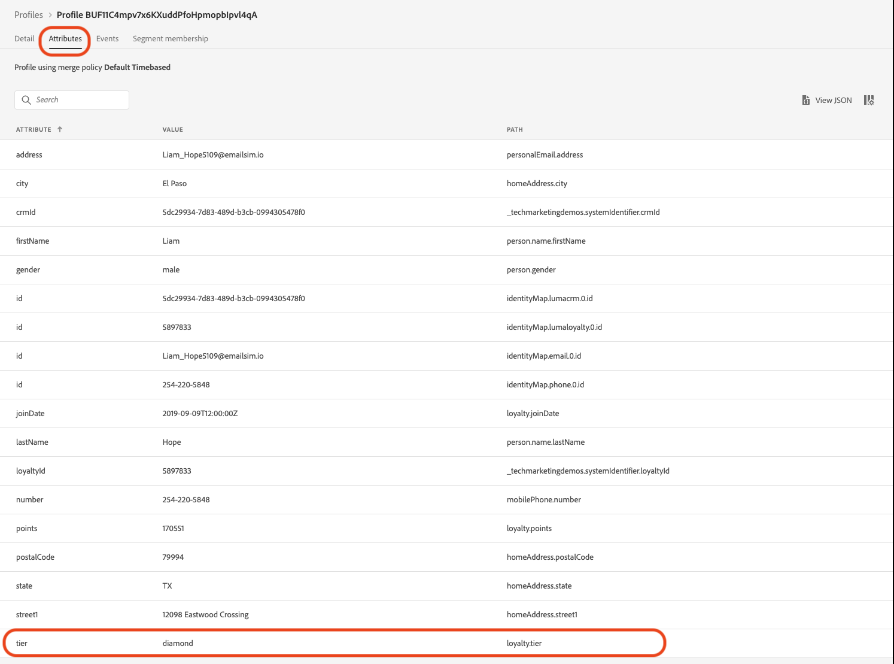

# Aankondiging van een zomerverzameling maken - uitdaging

| Uitdaging | Een mededeling voor een zomerverzameling maken |
|---|---|
| Persona | Reismanager |
| Vereiste vaardigheden | <ul><li>[ creeer segmenten ](https://experienceleague.adobe.com/docs/journey-optimizer-learn/tutorials/profiles-segments-subscriptions/create-segments.html?lang=en)</li><li> [ de Invoer en auteurHTML e-mailinhoud ](https://experienceleague.adobe.com/docs/journey-optimizer-learn/tutorials/create-messages/create-emails/import-and-author-html-email-content.html?lang=en)</li><li>[ Geval van het Gebruik - Gelezen segment ](https://experienceleague.adobe.com/docs/journey-optimizer-learn/tutorials/journeys/use-case-read-segment.html?lang=en)</li> |
| Assets downloaden | [ Seizoensgebonden de e-maildossiers van de Inzameling ](/help/challenges/assets/email-assets/emails-seasonal-collection-announcement.zip) |

{style="table-layout:auto"}

## Het artikel

Luma, een fictioneel atletisch kledingbedrijf, promoot zijn nieuwste kleding en tandwielcollectie en drijft de verkoop voor bestaande klanten aan. Luma lanceert de nieuwe zomerverzameling en wil zich specifiek richten op verschillende doelgroepen.

## Uw uitdaging

Het marketingteam van Luma vraagt u om een marketingcampagne voor Summer Collection in Journey Optimizer uit te voeren. Uw uitdaging is:

* Maak een publiek waarin wordt gedefinieerd welke profielen in aanmerking komen om de speciale actie te ontvangen.
* Bouw de reis.

### Stap 1: Bepaal het publiek - Actieve Klanten

>[!BEGINTABS]

>[!TAB Taak]

#### Een publiek maken in [!DNL Journey Optimizer]

* Creeer een publiek in [!DNL Journey Optimizer] geroepen *Actieve Klanten*.
* Het segment moet alleen actieve Luma-klanten bevatten.
* Actieve klanten worden gedefinieerd als klanten met een laag in het loyaliteitsprogramma van Luma (bronze, zilver, goud of platina).


>[!TAB  Criteria van het Succes ]

In de segmentbouwer, kunt u het geschatte aantal gekwalificeerde profielen zien. Als u met de gegevens van de trainingssandbox werkt, hebt u ongeveer 753 gekwalificeerde profielen van 1,29 kB.

>[!NOTE]
>Het kan tot 24 uren duren voor het segmentlidmaatschap voor bestaande profielen verschijnt, aangezien de bestaande profielen moeten worden teruggevuld.

**A het kwalificeren profiel is toegevoegd aan het segment:**

U kunt controleren welke profielen aan het segment zijn toegevoegd door aan één van in de profielen te navigeren die op de de detailmening van uw segment worden vermeld.

Voor de profielpagina, controleer het [!UICONTROL  lusje van Attributen ] om te bevestigen dat zij kwalificeren: De rij zou zilver, goud, platina, of ruitje moeten zijn.



U kunt het [!UICONTROL  lusje van het het lidmaatschap van het 0} Segment ook controleren: Uw segment zou moeten worden vermeld.]


>[!TAB  Controle uw werk ]

De gebieden van het segment: **[!UICONTROL Attributen]** > **[!UICONTROL XDM individueel Profiel]** > **[!UICONTROL Loyalty]** > **[!UICONTROL Rij]**

Zo ziet uw segment eruit:


De code moet er als volgt uitzien:

```javascript
stringCompare("equals", loyalty.tier, ["diamond", "gold", "platinum", "silver"], false)
```

>[!ENDTABS]


### Stap 2: Maak de aankondiging van de reis - zomerverzameling

>[!BEGINTABS]

>[!TAB Taak]

#### De aankondiging van de zomerverzameling verzenden

Een bureau heeft u vier HTML-bestanden geleverd met het ontwerp voor de e-mails:

* `SeasonalCollectionEmail.html`
* E-mail verzameling Luma Men&#39;s
* E-mail over verzameling van vrouwen in de luminantie
* Luminantie - 20 % korting op e-mail verzameling

1. [ Download de seizoensgebonden E-maildossiers van de Inzameling ](/help/challenges/assets/email-assets/emails-seasonal-collection-announcement.zip).

1. Creeer een reis genoemd *Luma - de aankondiging van de Inzameling van de Zomer* die op de volgende richtlijnen wordt gebaseerd:

   1. Verzend *Luma - de Nieuwe Aankondiging van de Inzameling van de Zomer* e-mail naar het *Actieve segment van Klanten*, die uit 10% van het publiek als controlegroep houden
      * De titel van het bericht *Luma - de Aankondiging van de Inzameling van de Zomer*
      * Onderwerpregel *(de voornaam van de ontvanger), is de nieuwe inzameling van de zomer van de Luma hier!*
      * Gebruik het opgegeven HTML-bestand `SeasonalCollectionEmail.html` voor de hoofdtekst van de e-mail.
   1. Wacht twee dagen en verzend een vervolgbericht met meer gerichte inhoud:
      * De mannelijke klanten zouden de **e-mail van de Inzameling van Mannen 0} moeten ontvangen Luma.**
         * De titel van het bericht: *de Inzameling van Mannen Luma*
         * Onderwerpregel: *(voornaam van ontvanger), ontdek de nieuwe atletische uitrusting van Men!*
         * Hoofdtekst van e-mail: `MensCollectionEmail.html` voor de hoofdtekst van de e-mail.
      * Vrouwelijke klanten zouden de **e-mail van de Inzameling van de Vrouwen van 0} Luma moeten ontvangen.**
         * De titel van het bericht: *Verzameling van de Vrouwen van 0} Luma*
         * Onderwerpregel: *(voornaam van ontvanger), verken de Vrouwen van Luma Inzameling!*
         * Hoofdtekst van e-mail: `WomensCollectionEmail.html`
      * Andere klanten zouden **Luma - 20 % van de e-mail van de Inzameling** moeten ontvangen.
      * De titel van het bericht: *Luma - 20 % van Inzameling*
      * Onderwerpregel: *(voornaam van ontvanger), geniet van 20% korting op de verkoop!*
      * Hoofdtekst van e-mail: `20OOffCollectionEmail.html`
   1. Wacht twee dagen nadat u de hierboven vermelde e-mailberichten hebt verzonden
   1. Als het gerichte e-mailbericht niet binnen 2 dagen wordt geopend, verzend **Luma - 20 %off e-mail van de Inzameling** als definitieve het opnieuw richten poging


>[!TAB  criteria van het Succes ]

#### E-mails voorvertonen

**E-mailbericht #1 - Luma - de mededeling van de inzamelingsinzameling van de Zomer**

E-mailvoorvertoning:

1. Voeg een testprofiel toe: Louise Petti
   * Identiteitsnaamruimte: *identiteitskaart van CRM Luma*
   * Identiteitswaarde: *d1f132f9f9502bba047a6ec86c4b61f9*

Resultaat

* De onderwerpregel zou moeten lezen: Louise, de nieuwe inzameling van de Luma is hier!

**E-mailBericht #2 - de Inzameling van Mannen Luma**

Een proefdruk naar uzelf sturen:

1. Voeg een testprofiel toe: Stanleigh Stooke:
   * Identiteitsnaamruimte: *identiteitskaart van CRM Luma*
   * Identiteitswaarde: `4f34057d9d9e792c28ba18ecae378e98`
2. Selecteer het testprofiel: Stanleigh Stooke.
3. Stuur een proef naar uzelf.

Resultaat\
Je ontvangt een e-mail. De onderwerpregel zou *Stanleigh moeten lezen, onderzoek Mannen Nieuwe atletische uitrusting!* en de hoofdtekst van de e-mail moeten overeenkomen met wat u in de voorvertoning hebt gezien.

>[!NOTE]
>Het kan een paar minuten duren voordat je de proefdruk ontvangt.

**E-mail bericht #3 - de Inzameling van de Vrouwen van Luma**

Voorproef e-mail met het testprofiel *Louise Petti.*

* De onderwerpregel zou moeten lezen: *Louise, onderzoek de Inzameling van de Vrouwen van Luma!*

**E-mail bericht #4 - Luma 20 % van Inzameling**

Voorproef e-mail met het testprofiel *Louise Petti.*

* De onderwerpregel zou moeten lezen: *Louise, geniet van 20% van verkoop!*

#### Uw reis testen

>[!IMPORTANT]
>
>Voordat u de overgang naar de testmodus instelt:
>
>1. Zorg ervoor dat de [!UICONTROL  Gelezen Activiteit van het Segment ] namespace heeft die aan **wordt geplaatst Luma CRM identiteitskaart (lumaCrmId)**
>1. Overschrijf voor elke e-mail de standaard e-mailparameters voor de e-mail, zodat deze naar uw e-mailadres worden verzonden:
>    * Verborgen waarden weergeven door op het oogsymbool te klikken.
>    * Klik in de e-mailparameters op het T-symbool (parameteroverschrijving inschakelen).
>
>      
> 
>    * Klik in het [!UICONTROL  gebied van het Adres ]
>    * Voeg in het volgende scherm uw e-mailadres tussen haakjes toe: `"yourname@yourdomain"` in de expressieeditor en klik op OK.
>

Test de reis en stuur de e-mails naar je eigen account:

1. Zet de reis in testmodus.
1. Selecteer **[!UICONTROL Enig profiel tegelijkertijd]**.
1. Wacht tijd: plaats de tijdopnemer aan 120 seconden (typ het in het gebied).
1. Invoer van triggerprofiel
1. U kunt elke tak testen door één van de volgende *IDS van CRM van de Luma* als profielherkenningstekens te gebruiken:
   * Vrouwelijk: Leora Dietsche, Identiteitswaarde:`a8f14eab3b483c2b96171b575ecd90b1`
   * Mannelijk: Stanleigh Stooke, Identiteitswaarde: `4f34057d9d9e792c28ba18ecae378e98`
   * Gender niet opgegeven: Louise Petti, Identity value: `d1f132f9f9502bba047a6ec86c4b61f9`

1. Nadat u de profielingang teweegbrengt, zou u eerste e-mail moeten ontvangen. De koptekst moet worden aangepast aan het profiel dat u hebt gekozen.
1. De reis zou in de respectieve tak moeten verdergaan, en u zou verwante e-mail (bijvoorbeeld, als u *Wenen* koos, zou u *3} e-mail van de Inzameling van de Vrouwen van de Luma moeten ontvangen).*
1. Open de tweede e-mail en de reis moet worden beëindigd.
1. U kunt stap 4 herhalen. - 7. voor alle drie de profielen om te controleren of uw takken correct werken.
1. Als u de time-outs wilt testen, stelt u de wachttijd in op 30 seconden en activeert u de invoer opnieuw.
1. Open de e-mails die u ontvangt niet (bekijk geen voorbeeld van het e-mailbericht (!)) en laat de wachttijd verstrijken.

Je ontvangt de volgende e-mails:

* Luma - Nieuwe aankondiging van seizoensverzameling
* Afhankelijk van het testprofiel dat u hebt gebruikt, ontvangt u een van de volgende e-mails:
   * Leora: Vrouwencollectie Luma
   * Stanleigh: Luma Men&#39;s Collection
   * Loep: Luminantie - 20% korting op verzameling
* Als u het tweede e-mailbericht niet hebt geopend: De Luma - 20% korting op de verzameling

>[!TAB  Controle uw werk ]

Zo ziet uw reis eruit:


**Voorwaarde - de Groep van de Controle:**


**Voorwaarde - Geslacht:** \


>[!ENDTABS]
