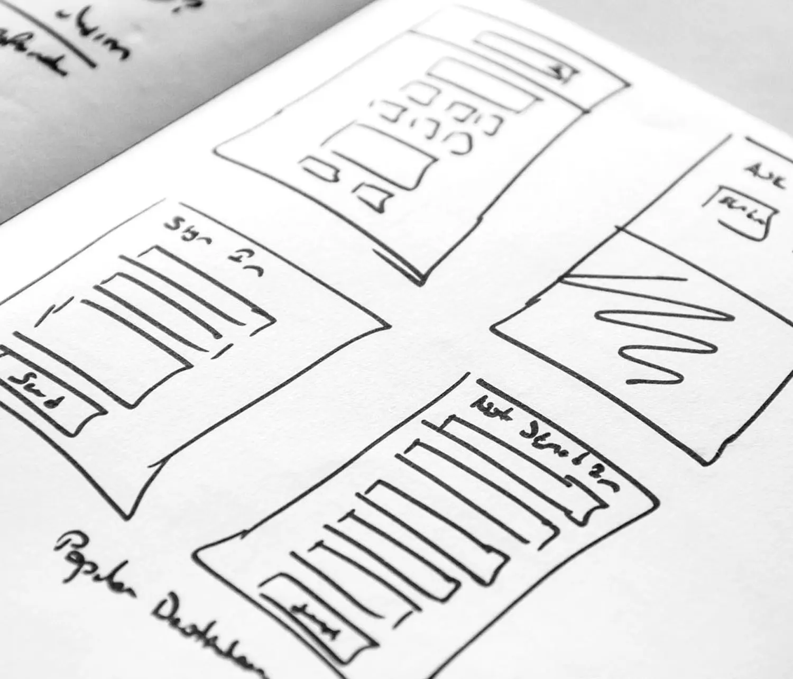

# Journey Optimizer - Mobile Learning Hub

Jumpstart of level up with mobile channels in Adobe Journey Optimizer (AJO). Dit is de vrije ruimte voor ontwikkelaars, beheerders, marketers, en gegevensanalisten om alles te ontdekken van vestiging binnenkomende en uitgaande mobiele kanalen aan het weven van hen in krachtige campagnes.

Ontdek best practices, leer hoe u adoptie kunt stimuleren en master reporting — allemaal op één plaats — zodat teams effectieve, gegevensgestuurde mobiele ervaringen kunnen bieden die op elk moment, overal en altijd verbinding maken met gebruikers.

>[!VIDEO](https://video.tv.adobe.com/v/3432681?quality=12&learn=on){transcript=true}

## Overzicht van mobiele kanalen

Journey Optimizer ondersteunt zowel binnenkomende als uitgaande mobiele kanalen:

### Uitgaande kanalen

De uitgaande kanalen worden gebruikt om **berichten** aan klanten proactively te leveren zonder voorafgaande interactie te vereisen. Deze zijn ideaal voor campagnes, promoties, en transactionele mededelingen.

Deze kanalen dwingen **het Beleid van de Toestemming van de Douane** bij bericht af verzendt tijd. Als er geen toestemming wordt verleend voor een specifieke marketingactie, wordt het bericht geblokkeerd.

|  {width= &quot;250&quot;, height= &quot;250&quot;}   **[Push Meldingen](/help/mobile-learning-hub/channels/push-notifications-overview.md)** |  {width= &quot;250&quot;, height= &quot;250&quot;}   **[SMS / MMS / RCS](/help/mobile-learning-hub/channels/sms-mms-rcs-overview.md)** |  &lbrace;width= &quot;250&quot;, height= &quot;250&quot;  **[WhatsApp](/help/mobile-learning-hub/channels/whatsapp-overview.md)** |
|-------------------------------------|------------------------------------|-------------------------------|
| Verzonden buiten de app, duw op berichten neemt onmiddellijk aandacht. Ze zijn ideaal voor tijdgevoelige updates en moedigen gebruikers aan om terug te keren naar uw app. | Rechtstreekse berichten die zonder app naar mobiele telefoons van gebruikers worden verzonden. Ideaal voor urgente waarschuwingen, herinneringen en rijke media-inhoud, zoals afbeeldingen of video&#39;s. | Conversationeel kanaal door een wijd gebruikte overseinen app, die gepersonaliseerde, bidirectionele communicatie en interactieve campagnes toestaat. |

### Binnenkomende kanalen

De binnenkomende kanalen worden ontworpen voor **klant-in werking gestelde interactie**, toelatend gepersonaliseerde ervaringen wanneer de gebruikers met uw merk in dienst nemen. Zij steunen **verpersoonlijking in real time** en **gegevens vangen**, zoals het landen van paginavormen die in Adobe Experience Platform (AEP) voor segmentatie en het richten voeden.

|  {width= &quot;250&quot;, height= &quot;50%&quot;}   **[In-app Berichten](/help/mobile-learning-hub/channels/in-app-messages-overview.md)** |  {width= &quot;250&quot;, height= &quot;250&quot;}   **[Kaarten van de Inhoud](/help/mobile-learning-hub/channels/content-cards-overview.md)** |  {width= &quot;250&quot;, height= &quot;250&quot;}   **[code-Gebaseerde Ervaring](/help/mobile-learning-hub/channels/code-based-experience-overview.md)** |
|-------------------------------------|------------------------------------|-------------------------------|
| Deze berichten worden geleverd terwijl gebruikers uw app actief gebruiken en zijn in real time en interactief. Ze zijn ideaal om klanten op dit moment te engageren. | Niet-opdringerige, permanente berichten die gebruikers op elk moment in de app kunnen openen. Inhoudskaarten zijn handig als u doorlopende aanbiedingen of nuttige informatie wilt delen. | Aangepaste, gecodeerde berichten maken gepersonaliseerde en dynamische campagnes mogelijk, waarbij real-time gegevens en complexe klantritten worden geïntegreerd. |

### Hoe kunnen mobiele kanalen samenwerken?

Door deze kanalen te combineren, kunt u een naadloze en efficiënte klantenervaring tot stand brengen:

1. Gebruik [&#x200B; dupberichten &#x200B;](/help/mobile-learning-hub/channels/push-notifications-overview.md) om aandacht snel te pakken en gebruikers terug naar uw app (b.v., &quot;Sale begint nu!&quot;) te brengen.

2. Zodra binnen, lever [&#x200B; in-app berichten &#x200B;](/help/mobile-learning-hub/channels/in-app-messages-overview.md) met gepersonaliseerde bevorderingen (b.v., &quot;hier is uw 15% korting voor de verkoop van vandaag&quot;).

3. De inhoudskaarten van het aanbod [&#128279;](/help/mobile-learning-hub/channels/content-cards-overview.md) zodat kunnen de gebruikers de bevordering op elk ogenblik terugkeren alvorens het verloopt (b.v., &quot;Uw 15% korting beëindigt Vrijdag&quot;).

4. Gebruik [&#x200B; SMS/MMS/RCS &#x200B;](/help/mobile-learning-hub/channels/sms-mms-rcs-overview.md) om geschikte herinneringen of rijke media aanbiedingen rechtstreeks naar gebruikers te verzenden die niet in app kunnen zijn.

5. Mogen klanten in zinvolle gesprekken door [&#x200B; WhatsApp &#x200B;](/help/mobile-learning-hub/channels/whatsapp-overview.md), ideaal voor klantensteun of interactieve campagnes in dienst nemen.

6. De op code-gebaseerde ervaringen van de hefboomwerking [&#x200B; om elk bericht te maken dat op gebruikersgedrag en voorkeur wordt gebaseerd, die tot een werkelijk gepersonaliseerde reis over kanalen leiden.](/help/mobile-learning-hub/channels/code-based-experience-overview.md)

## Gebruikskwesties voor klanten

* [&#x200B; neem vlucht met personalisatie: Hoe de luchtvaartmaatschappijen aanbiedingen met Adobe Journey Optimizer (blog) kunnen opheffen &#x200B;](https://experienceleaguecommunities.adobe.com/t5/journey-optimizer-blogs/take-flight-with-personalization-how-airlines-can-elevate-offers/ba-p/767513)

## Uw basis opbouwen

Leer de concepten en hoe te

<table style="table-layout:fixed">
  <tr style="border: 0;">
    <td>
    
    
<strong> vormt &amp; de Lancering </strong>  vormt de mobiele kanalen en integreert met mobiele apps.

    </td>
    <td>
    
    
<strong> Ontwerp &amp; lever </strong>  Mobiele kanalen van het Gebruik om gepersonaliseerde reizen en campagnes te bouwen die klanten in real time in dienst nemen.

    </td>
    <td>
    
    
<strong> maatregel &amp; optimaliseer </strong>  de rapporten van de Toegang, analyseert prestaties, en verfijnen strategieën voor betere resultaten.
    

    </td>
  </tr>
</table>

## Gebruiksscenario&#39;s voor mobiele zakelijke doeleinden

| Gebruiksscenario | Beschrijving | Gebruik van mobiele kanalen |
|---------|-------------|----------------------|
| **app onboarding en Goedkeuring** | Hiermee begeleidt u nieuwe gebruikers door de eerste stadia van de betrokkenheid van de app: de toepassing installeren, de installatie voltooien en belangrijke functies ontdekken. Het doel is om het behoud en het gebruik op lange termijn te maximaliseren. | - Pushberichten en sms-welkomstgebruikers en snelle voltooiing van het profiel.  - In-app berichten markeren functies en moedigen eerste handelingen aan.  - Diepe koppelingen in e-mailberichten of advertenties sturen gebruikers naar specifieke toepassingsschermen voor een naadloze instaptoegang. |
| **plaats-Gebaseerde Betrokkenheid** | Levert gepersonaliseerde, geschikte berichten aan gebruikers die op hun fysieke nabijheid aan opslag, gebeurtenissen, of andere relevante plaatsen worden gebaseerd. | - Pushmeldingen met behulp van geo-fencing- en baken-technologie wanneer gebruikers doelzones betreden.  - SMS/MMS levert gelokaliseerde aanbiedingen en updates.  - In-app banners en kaarten passen inhoud aan op basis van realtime locatie. |
| **Terugbezetting van de verwaarlozing** | Doelgebruikers die winkelwagentjes, formulieren of browsersessies verlaten en die deze willen terughalen en de gewenste actie willen voltooien. | - Met pushberichten worden gebruikers herinnerd aan verlaten winkelwagentjes of onvolledige handelingen.  - SMS-follow-ups bevatten stimulansen of directe koppelingen om te worden hervat. - Er worden aanwijzingen in de app weergegeven wanneer gebruikers terugkeren en ze bieden gepersonaliseerde aanbevelingen. |
| **Upsell en dwars-Verkoop Campagnes** | Hiermee worden extra producten of upgrades naar bestaande klanten bevorderd op basis van hun gedrag, voorkeuren of aankoopgeschiedenis. | - Met pushberichten worden relevante upselmogelijkheden benadrukt.  - In-app berichten en inhoudskaarten bevatten aanvullende items.  - SMS-campagnes richten zich op gesegmenteerde doelgroepen met exclusieve aanbiedingen. |
| **Preventie van de Knevel** | Identificeert gebruikers die het risico lopen te verlaten en verbindt hen met gepersonaliseerde bewaarstrategieën om loyaliteit te handhaven. | - Predictieve analyse leidt tot mobiele outreach voor risicogebruikers.  - Push-berichten en SMS bieden loyaliteitsbeloningen of gepersonaliseerde inhoud. - In-app enquêtes verzamelen feedback om retentiestrategieën te verbeteren. |
| **Meerkanaals Overseinen** | Orchestrates consistent messaging over meerdere mobiele kanalen om ervoor te zorgen dat gebruikers tijdig relevante communicatie ontvangen. | - Duwen, in-app, SMS en e-mail worden gecoördineerd voor Unified Messaging.  - SDKs laat verpersoonlijking in real time over kanalen toe.  - Inhoudskaarten blijven tijdens sessies aanwezig om toetsberichten te versterken. |
