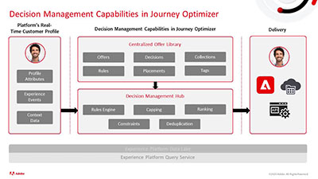

# Tutorials voor Journey Optimizer

Journey Optimizer helpt bedrijven hun klanten verbonden, contextafhankelijke en persoonlijke ervaringen te bieden. De customer journey is het hele proces van de interacties van een klant met het merk, vanaf het eerste contactmoment totdat de klant de site verlaat.

Dit handboek bevat video’s en tutorials over de vele functies en mogelijkheden van Adobe Journey Optimizer.

## Nieuwe functies

* **[Dynamische inhoud maken met de ontwikkelaar voor voorwaardelijke regels](/help/personalize-content/create-dynamic-content.md)**
  *Leer voorwaardelijke regels te maken en op te slaan, en leer deze voorwaardelijke regels toepassen op content over alle kanalen.*

* **[Waarschuwingen gebruiken](/help/administration/alerts.md)**
  *Ontdek hoe u vooraf gedefinieerde waarschuwingen kunt ontvangen voor onverwacht journeygedrag en hoe u meldingen kunt ontvangen via e-mail, in Journey Optimizer of via een API.*

* **[Een journey naar een andere sandbox kopiëren](/help/create-journeys/copy-a-journey.md)**
  *Ontdek hoe u een journey en zijn afhankelijke objecten van de ene sandbox naar de andere kunt kopiëren.*

* **[Gegevens in berichten maskeren](/help/privacy/mask-data-in-messages.md)**
  *Begrijp wat het maskeren van gegevens is en waarom we gegevens maskeren. Leer hoe u gegevens in Journey Optimizer-berichten kunt maskeren.*

## Live gebeurtenissen in Experience League

* **[Maximaliseer de mogelijkheden van uw mobiele app met Adobe Journey Optimizer](https://experienceleague.adobe.com/docs/events/experience-league-live-recordings/episodes/exl-live-episode-5-24-23.html?lang=en)**
  *Leer de voordelen van berichtgeving in de app als een realtime service-kanaal en hoe u persoonlijke ervaringen met mobiele apps in Adobe Journey Optimizer kunt configureren en ontwerpen.*

* **[De toekomst van Adobe Journey Optimizer verkennen met het webkanaal en content experimenteren](https://experienceleague.adobe.com/docs/events/experience-league-live-recordings/episodes/exl-live-episode-6-14-23.html?lang=en)**
  *Het nieuwe Webkanaal laat marketers toe om Webcampagnes met een visuele ontwerper te bouwen WYSIWYG. Bovendien kunt u met Journey Optimizer nu experimenteren met inhoud in elk kanaal, zoals e-mail, web, push, in-app, SMS en meer.*

* **[Uw campagnes uitvoeren in Adobe Journey Optimizer](https://experienceleague.adobe.com/docs/experience-league-live-events/events/episodes/exl-live-episode-09-22-22.html?lang=nl)**
  *In deze Experience League Live-aflevering, oorspronkelijk gehouden op 22 september 2022, ziet u gastvrouw Sandra Hausmann en productdeskundigen Bridgette Darling en Frederic Mary bij het bespreken van de gebruiksscenario&#39;s waarop deze nieuwe functie betrekking heeft en hoe een campagne in Journey Optimizer eenvoudig kan worden opgezet en uitgevoerd.*

* **[Pushmeldingen met Adobe Journey Optimizer](https://experienceleague.adobe.com/docs/experience-league-live-events/events/episodes/exl-live-episode-05-12-22.html?lang=nl)**
  *In deze Experience League Live-aflevering praten we over doorsnee gebruiksscenario&#39;s voor pushberichten met Adobe Journey Optimizer en gaan we in op de technische details over het configureren van een app voor Push die wordt aangestuurd door Adobe Experience Platform.*

## Personeelsselectie

<table>
<tr>
  <td>
    
    

      <a href="./introduction/journey-optimizer-overview-part-1.md">
    <strong>Journey Optimizer - overzicht deel 1  </strong>
    </a>
    

    

    <em>Deze video laat zien hoe merken Adobe Journey Optimization kunnen gebruiken om gepersonaliseerde omnichannel-journeys aan hun consumenten te leveren.</em>
    

  </td>
    <td>
    
    

      <a href="./introduction/journey-optimizer-overview-part-2.md">
    <strong>Journey Optimizer - Overzicht deel 2  </strong>
    </a>
    

    

    <em>Deze video laat zien hoe merken de beslissingsbeheermogelijkheden, realtimesegmentkwalificatie en bedrijfsgebeurtenissenbeheer van Adobe Journey Optimizer kunnen gebruiken om hun klantjourneys naar nieuwe hoogten te tillen.</em>
    

  </td>
  </td>
    <td>
    
    

      <a href="./decision-management/create-decisions.md">
    <strong>Inleiding tot de mogelijkheden voor beslissingsbeheer </strong>
    </a>
    

    

    <em>De video behandelt de zakelijke problemen die worden opgelost door de mogelijkheden van beslissingsbeheer, wat de belangrijkste mogelijkheden zijn, de basisarchitectuur en de belangrijkste gebruiksscenario's.

</em>
    

  </td>
</tr>
<tr>
  <td>
    
    

      <a href="./create-journeys/use-case-transactional-journey.md">
    <strong>Gebruiksscenario - Transactionele journey </strong>
    </a>
    

    

    <em>Begrijp de toepasselijke gebruiksscenario's voor transactionele journeys. Leer hoe u transactionele journeys bouwt en welke aanbevolen procedures u kunt toepassen.</em>
    

  </td>
    <td>
    
    

      <a href="./personalize-content/use-contextual-event-information-for-personalization.md">
    <strong>Contextuele gebeurtenisinformatie gebruiken voor personalisatie </strong>
    </a>
    

    

    <em>Leer hoe u contextuele gebeurtenisinformatie van een journey kunt gebruiken om een bericht te personaliseren.</em>
    

  </td>
  </td>
    <td>
    
    

      <a href="./report-and-monitor/live-and-global-reports.md">
    <strong>Live en globale rapporten </strong>
    </a>
    

    

    <em>Leer het verschil tussen live en wereldwijde rapporten, hoe u de journey- en berichtspecifieke rapporten kunt openen en analyseren en hoe u de rapportdashboards kunt wijzigen.

</em>
    

  </td>
</tr>
</table>

