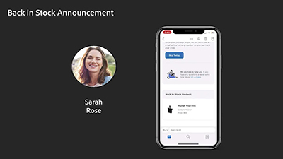

# Journey Optimizer-video's en -tutorials

Journey Optimizer helpt bedrijven hun klanten verbonden, contextafhankelijke en persoonlijke ervaringen te bieden. Het klanttraject is het hele proces van de interacties van een klant met het merk, vanaf het eerste contactmoment totdat de klant de site verlaat.

Dit handboek bevat video’s en tutorials over de vele functies en mogelijkheden van Adobe Journey Optimizer.

## Nieuwe functies

### Tutorials

* **[Lidmaatschappen en landingspagina's](/help/subscriptions-and-landing-pages.md)**

   *Leer hoe u lidmaatschappen configureert en landingspagina's maakt.*

* **[Opgeslagen expressies gebruiken en beheren in de personalisatiebibliotheek](/help/personalize-content/use-and-manage-saved-expressions-in-personalization-library.md)**

   *Ontdek hoe u opgeslagen bibliotheekitems voor personalisatie gebruikt in een bericht en hoe u bibliotheekitems voor personalisatie maakt en beheert.*

* **[CName-subdomeinen delegeren](/help/set-up-email-channel/delegate-cname-subdomains.md)**

   *Meer informatie over het maken van een subdomein met CNAME om naar Adobe-specifieke records te verwijzen.*

### Live gebeurtenissen Experiencen League

* **[Pushmeldingen met Adobe Journey Optimizer](https://experienceleague.adobe.com/docs/experience-league-live-events/events/episodes/exl-live-episode-05-12-22.html)**

   *In dit Experience League Live-aflevering praten we over de gebruikelijke gebruiksgevallen voor pushberichten met Adobe Journey Optimizer en duiken we de technische details in over hoe u een app voor Push kunt configureren die wordt aangedreven door Adobe Experience Platform.*

## Aanbevolen door medewerkers

<table>
<tr>
  <td>
    
    

      <a href="./introduction/journey-optimizer-overview-part-1.md">
    <strong>Journey Optimizer - overzicht deel 1  </strong>
    </a>
    

    

    <em>Deze video laat zien hoe merken Adobe Journey Optimization kunnen gebruiken om gepersonaliseerde omnichannel-journeys aan hun consumenten te leveren.</em>
    

  </td>
    <td>
    
    

      <a href="./introduction/journey-optimizer-overview-part-2.md">
    <strong>Journey Optimizer - Overzicht deel 2  </strong>
    </a>
    

    

    <em>In deze video wordt getoond hoe merken Adobe Journey Optimizer-mogelijkheden voor besluitvormingsbeheer, realtime segmentkwalificatie en bedrijfsgebeurtenisbeheer kunnen gebruiken om hun reizen naar een hoger niveau te tillen.</em>
    

  </td>
  </td>
    <td>
    
    

      <a href="./decision-management/create-decisions.md">
    <strong>Inleiding tot de mogelijkheden voor beslissingsbeheer </strong>
    </a>
    

    

    <em>De video behandelt de zakelijke problemen die worden opgelost door de mogelijkheden van beslissingsbeheer, de belangrijkste mogelijkheden, de basisarchitectuur en de belangrijkste gebruiksscenario's ervan.

</em>
    

  </td>
</tr>
<tr>
  <td>
    
    

      <a href="./create-journeys/use-case-transactional-journey.md">
    <strong>Gebruiksscenario - Transactionele journey </strong>
    </a>
    

    

    <em>Begrijp de toepasselijke gebruiksscenario's voor transactionele journeys. Leer hoe u transactionele journeys bouwt en welke aanbevolen procedures u kunt toepassen.</em>
    

  </td>
    <td>
    
    

      <a href="./personalize-content/use-contextual-event-information-for-personalization.md">
    <strong>Contextuele gebeurtenisinformatie gebruiken voor personalisatie </strong>
    </a>
    

    

    <em>Leer hoe u contextuele gebeurtenisinformatie van een journey kunt gebruiken om een bericht te personaliseren.</em>
    

  </td>
  </td>
    <td>
    
    

      <a href="./report-and-monitor/live-and-global-reports.md">
    <strong>Live en globale rapporten </strong>
    </a>
    

    

    <em>Leer het verschil tussen live en globale rapporten, hoe u de journey- en berichtspecifieke rapporten kunt openen en analyseren, en hoe u de rapportdashboards kunt wijzigen.

</em>
    

  </td>
</tr>
</table>
