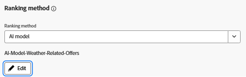

# Interacties met het vastlegaanbod met Adobe Web SDK for AI-modeltraining

>[!NOTE]
>
> Vul dit artikel alleen in als u in Adobe Journey Optimizer rangschikkingsmethoden op basis van AI wilt gebruiken om aan te geven welk aanbod wordt weergegeven op basis van een voorspelde betrokkenheid.


In dit artikel wordt getoond hoe u aanbiedingsinteractiegebeurtenissen (zoals indrukken of klikken) vastlegt met de Adobe Experience Platform Web SDK door legy(&quot;sendEvent,&quot; ...) rechtstreeks in uw JavaScript-code aan te roepen. De gegevens worden in AEP ingevoerd en gebruikt voor het trainen van AI-modellen in Adobe Journey Optimizer (AJO) voor een slimmer ranking op basis van real-time gedrag.

Als u een AI-model wilt maken voor de rangschikking van aanbiedingen in Adobe Journey Optimizer, moet uw gegevensset zijn gebaseerd op een schema dat de veldgroep Propositieinteracties bevat. Deze gebiedsgroep steunt zeer belangrijke beslissingsgebeurtenissen zoals decisions.propositionDisplay en decisions.propositionInteract, samen met vereiste gebieden zoals wendenProposities, vertoning, en interactie aan.

Er zijn twee geldige manieren om dit te bereiken:

- Creeer een nieuw die schema, dataset, en gegevensstroom specifiek voor interactie het volgen wordt gevormd
- Een bestaand schema bijwerken. Dit is wat u in deze zelfstudie doet


## Bestaand schema bijwerken om gebeurtenissen voor aanbiedingsinteractie vast te leggen

In plaats van een nieuw schema te creëren, wordt het bestaande schema van de Gebeurtenis van de Ervaring dat voor op weer betrekking hebbende aanbiedingen wordt gebruikt bijgewerkt om interactie het volgen te steunen.

In Adobe Experience Platform:

- Open het bestaande _**Weer-Schema**_ schema van de Gebeurtenis van de Ervaring dat u voor op weer-gebaseerde aanbiedingen gebruikt.

- Voeg de veldgroep toe:
Experience Event - Propositie-interacties

U te hoeven om geen nieuwe dataset of datastream tot stand te brengen — blijf gebruikend uw bestaande opstelling voor weeraanbiedingen. De verzonden gebeurtenissen sluiten aan bij de Adobe Journey Optimizer-verwachtingen voor het trainen van AI-modellen en het bijhouden van gebeurtenissen biedt prestaties.


Ga verder met de huidige gegevensset (u hoeft geen nieuwe gegevensset te maken)

De bestaande gegevensstroom is al geconfigureerd en wordt gebruikt in de eigenschap Adobe Experience Platform Tags — daar zijn geen wijzigingen nodig.

SDK van het Web leidt automatisch nieuwe interactiegebeurtenissen aan de correcte bestemming.

Deze gestroomlijnde opstelling zorgt ervoor dat alle besluiten en weergebeurtenissen in één enkele, verenigde dataset worden opgenomen, die voor de opleiding van AI modellen in Adobe Journey Optimizer ideaal is.


## Weergavegebeurtenissen opnameaanbod (indrukkingen)

De HTML-structuur van de aanbieding is gewijzigd om interactieve elementen op te nemen — met name `<a>` - en `<button>` -tags — zodat gebruikers kunnen deelnemen aan de aanbieding (bijvoorbeeld de knoppen Aanbieding aanvragen of Meer informatie).

Elke knoop omvat een gegeven-aanbieding-id attribuut zodat kan de overeenkomstige interactie behoorlijk worden gevolgd.


Om te registreren wanneer aanbiedingen aan gebruikers worden getoond, werd het bestaande dossier van JavaScript dat voor het teruggeven van weeraanbiedingen wordt gebruikt bijgewerkt om vertoningsgebeurtenis het volgen te omvatten.

Er wordt nu een Beslissing.propositionDisplay-gebeurtenis verzonden met de Adobe Web SDK (alloy.sendEvent) wanneer een of meer aanbiedingen worden weergegeven. Deze gebeurtenis bevat de vereiste weergave: 1-markering en verwijst naar de betreffende voorstellen.


```javascript
if (offerIds.length > 0) {
  alloy("sendEvent", {
    xdm: {
      _id: generateUUID(),
      timestamp: new Date().toISOString(),
      eventType: "decisioning.propositionDisplay",
      _experience: {
        decisioning: {
          propositionEvent: {
            display: 1
          },
          involvedPropositions: offerIds.map(id => ({
            id,
            scope: "web://gbedekar489.github.io/weather/weather-offers.html#offerContainer"
          }))
        }
      }
    }
  });
}
```

## Aanbieding vastleggen klikken op gebeurtenissen (interacties)

Om te volgen wanneer een gebruiker op een aanbieding klikt, hebben wij bestaande JavaScript bijgewerkt om naar kliks op zowel `<a>` als `<button>` elementen te luisteren die binnen de aanbiedingscontainer worden teruggegeven.

Wanneer een klik wordt ontdekt, wordt een Beslissing.propositionInteract gebeurtenis verzonden gebruikend het Web SDK van Adobe. De gebeurtenis omvat de noodzakelijke interactie: 1 markering en verwijst naar de specifieke aanbieding ID en beslissingsbereik.

```javascript
// Attach click tracking to <a> and <button> elements
wrapper.querySelectorAll("a, button").forEach(el => {
  el.addEventListener("click", () => {
    const offerId = el.getAttribute("data-offer-id") || item.id;
    console.log("Clicked element offerId:", offerId);

    alloy("sendEvent", {
      xdm: {
        _id: generateUUID(),
        timestamp: new Date().toISOString(),
        eventType: "decisioning.propositionInteract",
        _experience: {
          decisioning: {
            propositionEvent: {
              interact: 1
            },
            involvedPropositions: [{
              id: offerId,
              scope: "web://gbedekar489.github.io/weather/weather-offers.html#offerContainer"
            }]
          }
        }
      }
    });
  });
});
```

## Een AI-model maken voor volgorde van aanbiedingen in Adobe Journey Optimizer Offer Decisioning

Met deze gegevens, die beelden aanbieden en klikken nu die via het Web SDK worden gevangen en in Adobe Experience Platform worden opgeslagen, kunnen worden gebruikt om een AI model op te leiden dat voorspelt welke aanbiedingen hoogstwaarschijnlijk de betrokkenheid zullen drijven.

Naar dit AI-model wordt verwezen in een rangschikkingsformule of selectiestrategie om te bepalen aan welke aanbiedingen voor elke gebruiker prioriteit wordt toegekend.
- Aanmelden bij Journey Optimizer
- Ga naar Beslissing -> Strategie-instelling -> AI-modellen ->AI-model maken
- Zorg ervoor dat u de juiste gegevensset gebruikt
  
- Sla het AI-model op en activeer het.
- Werk de selectiestrategie bij die in de vorige stap is gemaakt om het AI-model te gebruiken voor de beoordelingsmethode
  

## De oplossing testen

Omvat het [ bijgewerkte dossier van JavaScript ](assets/ai-model.js) in de [ bestaande Web-pagina ](assets/weather-offers.html)