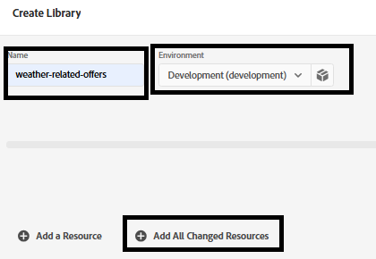

# AEP-tags maken

Met Adobe Experience Platform Tags (voorheen Adobe Launch) kunt u marketing- en analysetechnologieën* op uw website beheren en implementeren zonder dat u de code van de site hoeft te wijzigen.

Deze [ video beschrijft het proces om de Markeringen van de Ervaring van Adobe te creëren ](https://experienceleague.adobe.com/nl/playlists/experience-platform-get-started-with-tags)

* Aanmelden bij gegevensverzameling
* Klik op Labels -> Nieuwe eigenschap
* Creeer een markering van Adobe Experience Platform genoemd _&#x200B;**verpersoonlijking-op-weer**&#x200B;_.

* De volgende extensies toevoegen aan de tag
  

* Zorg ervoor om het Web SDK van Adobe Experience Platform te vormen om het correcte milieu en **weer-verwant-datastream** te gebruiken die in de vroegere stap wordt gecreeerd.
  


## AEP-tags maken en implementeren


Maak een nieuwe bibliotheek en voeg alle gewijzigde bronnen aan de bibliotheek toe, zoals geïllustreerd in de onderstaande schermafbeeldingen.

**voeg bibliotheek** toe


**creeer een bibliotheek**

Geef in het scherm Bibliotheek maken de naam van de bibliotheek en de omgeving op.

Alle gewijzigde bronnen toevoegen aan deze bibliotheek


Klik vervolgens op de knop Opslaan en bouwen naar ontwikkeling om de bibliotheek te maken

## AEP-tags opnemen op de HTML-pagina

Wanneer u een AEP-eigenschap Tags publiceert, geeft Adobe u een scripttag die u in de HTML ``` <head>``` -tags of onder aan de ``` <body>``` -tags moet plaatsen.

* Ga naar de eigenschap Tags (personalization-on-weer).

* Klik op Milieu&#39;s en klik het installatiepictogram van het milieu u wilt (bijvoorbeeld, Ontwikkeling, het Staging, Productie).

* Noteer de ingesloten code. Dit is nodig in een later stadium van deze zelfstudie.
