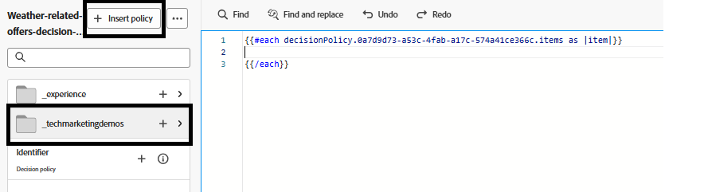

# Een campagne maken

Om gepersonaliseerde aanbiedingen aan gebruikers op de Web-pagina te leveren, werd een campagne gecreeerd in Adobe Journey Optimizer en gevormd met het correcte kanaal, op code-gebaseerd ervaringskanaal. Deze configuratie zorgt ervoor dat de aanbiedingen via real-time besluitvorming worden geleverd aan gebruikers die met de website communiceren.

Binnen deze campagne werd een beslissingsbeleid gedefinieerd om te bepalen hoe aanbiedingen worden geselecteerd. Het besluitvormingsbeleid omvat een selectiestrategie die bestaat uit:

- Een verzameling aangeboden items (bijvoorbeeld op basis van aan het weer gerelateerde labels);
- Geschiktheidsregels die bepalen welke aanbiedingen op een gebruiker van toepassing zijn, en
- Een rangschikkingsformule die scores toewijst aan in aanmerking komende aanbiedingen om prioriteit te geven aan de meest relevante aanbiedingen.

Wanneer een gebruiker de website bezoekt, detecteert het systeem de locatie en haalt het de huidige temperatuur op met behulp van een API voor weer. Deze temperatuurgegevens worden vervolgens via de Web SDK (Alloy) naar Adobe Experience Platform verzonden. Op basis van deze contextuele gegevens in real time evalueert Adobe Journey Optimizer vooraf gedefinieerde aanbiedingen die zijn getagd voor specifieke weersomstandigheden, zoals warm, mild of koud. De meest relevante aanbieding met behulp van de selectiestrategie en de rangschikkingsformule wordt automatisch weergegeven op de webpagina met behulp van de Adobe-beslissingsengine, zodat de gebruiker gepersonaliseerde inhoud ontvangt die is afgestemd op het huidige weer in zijn gebied.

## Stappen op hoog niveau om een campagne te maken in AJO

- Een kanaalconfiguratie maken
   - Bepaal waar en hoe de aanbiedingen worden weergegeven (bijvoorbeeld een webpagina met ervaring in code).
   - Aanmelden bij Reisoptimzer
   - Navigeer aan _&#x200B;**Beleid ->Kanalen ->creeer kanaalconfiguratie**&#x200B;_
   - **Naam**: `offers-by-weather`\
     Identificeert deze configuratie voor gepersonaliseerde levering van Webaanbieding.
- **Kanaal**:
  `Code-based experience`\
  Aanbiedingen worden niet rechtstreeks in het DOM geïnjecteerd. In plaats daarvan retourneert AJO raw HTML dat wordt geparseerd met behulp van aangepaste JavaScript.
- **Platform**: `Web`\
  Specifiek gericht op webbrowsers. Er zijn geen mobiele kanalen ingeschakeld.

- **pagina URL**: `https://gbedekar489.github.io/weather/weather-offers.html`\
  Het kanaal wordt gevormd voor een specifieke testpagina die tijdens ontwikkeling wordt gebruikt.
- **Plaats op Pagina**: `offerContainer`\
  Geretourneerde aanbiedingen worden dynamisch geparseerd en in deze container gerenderd met behulp van frontend-logica.

- **Formaat van de Inhoud**: `HTML`\
  De aanbiedingen worden geleverd als onbewerkte HTML-fragmenten, zodat u volledige controle hebt over de stijl, filtering en weergave van de fragmenten.

- **Begin een Nieuwe Campagne**
   - Navigeer naar de sectie Campagnes en maak een nieuwe geplande marketingcampagne. Geef de campagne een relevante naam.
   - **voeg Actie** toe
      - Voeg op code-gebaseerde-ervaring actie toe en verbind de actie met een eerder gecreeerde kanaalconfiguratie.

   - **Doelgroep**
      - Alle bezoekers (standaard).
      - Identiteitstype: ECID (Experience Cloud-id)
Deze instelling gebruikt de ECID als primaire identiteit voor het herkennen van gebruikers.

- **creeer het Beleid van het Besluit**
   - De actie is verbonden met het Beleid van het a **Besluit** dat bepaalt hoe de aanbiedingen worden geselecteerd en hoeveel aanbiedingen voor vertoning zijn teruggekeerd. Dit beleid gebruikt a **Strategie van de Selectie** die vroeger in het leerprogramma werd gecreeerd.
   - Om het besluitvormingsbeleid op te nemen geeft de klik **_inhoud_** in de secties van Acties uit en klikt dan **_code_** uit om de verpersoonlijkingsredacteur te openen.
   - Selecteer _&#x200B;**pictogram van het Beleid van het Besluit**&#x200B;_ op de linkerzijde en klik op **voeg besluitvormingsbeleid** knoop toe om **te openen creeer besluitvormingsbeleid** scherm. Geef het beslissingsbeleid een betekenisvolle naam en selecteer het aantal items dat het beslissingsbeleid moet retourneren. De standaardwaarde is 1.
   - Klik **_volgende_**, en voeg de selectiestrategie toe die in de vroegere stap aan het besluitvormingsbeleid wordt gecreeerd en klik **daarna** om het proces te voltooien om het besluitvormingsbeleid te creëren. Er zijn geen terugvalvoorstellen gekoppeld aan het besluitvormingsbeleid.

- **Tussenvoegsel het Beleid van het Besluit**
  

  Tussenvoegsel het onlangs gecreeerde besluitvormingsbeleid door op de _&#x200B;**knoop van het Beleid van het Tussenvoegsel**&#x200B;_ te klikken. Dit neemt een for lijn in de verpersoonlijkingsredacteur aan de rechterkant op.
Plaats de cursor tussen elke lus op regel twee en voeg de offerText in door naar het aanbod te navigeren door de `tenant name` omlaag te boren. Plaats de aanbieding in Div met het aanbod-punt van de klasse zoals aangetoond in het schermafbeelding.

- **publiceer de Campagne**\
  Activeer de campagne om persoonlijke aanbiedingen in real-time te leveren.
