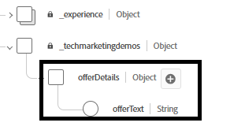

# Aanbiedingen maken om dynamische beslissingen en beoordelingen te testen

Deze aanbiedingen zijn ontworpen om dynamische besluitvorming en rangschikking te testen op basis van contextafhankelijke invoer in real time (zoals temperatuur), doorgegeven via de Adobe Web SDK (legy(&quot;sendEvent&quot;)).

Voordat u de aanbiedingen ging maken, werd het aanbiedingsitemschema uitgebreid met een nieuw veld: aanbiedingText

.

De volgende 3 aanbiedingen maken


## Heet Weatheraanbod (markering :hot)

De aanbiedingstekst voor warme weeraanbiedingen

```html
<div data-tags="weather hot skincare sunscreen" style="border: 1px solid #e0e0e0; padding: 1.5rem; border-radius: 10px; background-color: #fff3e0;">   <h2 style="color: #e65100;">Protect Your Skin This Summer</h2>   <p>High temperatures mean high UV risk. Get <strong>20% off</strong> our dermatologist-recommended sunscreens and skin protection kits.</p>   <p>Offer valid this week only for areas with temperatures over 90°F.</p> <button  class="ajo-cta"> Shop Sunscreen</button>   </div>
```


## Mild Weather Offer (markering :spring)

De aanbiedingstekst voor zacht weer

```html
<div class="offer-content" style="text-align: center; padding: 1rem;">      <h2>Grow More Than Just Flowers 🌿</h2>   <p>     Spring is here, and it's the perfect time to cultivate your garden — and your savings!     Enjoy <strong>$50 off</strong> when you spend $250 or more on gardening tools, seeds, and accessories.   </p>   <p><strong>Promo Code:</strong> <code>GROWSPRING</code></p>   <p><em>Offer valid through May 31. Let your garden — and your wallet — thrive.</em></p> <button  class="ajo-cta"> YES,I want this offer</button> </div>
```

## Koud Weather-aanbod (tag :cold)

De aanbiedingstekst voor koude weerproducten

```html
<div class="offer-content" style="text-align: center; padding: 1rem;">      <h2>Cold Weather, Hot Deals 🧤</h2>   <p>Stay warm in style with our exclusive <strong>25% off</strong> winter outerwear. From puffer jackets to wool scarves, find the perfect layers to beat the chill.</p>   <p><strong>Use code:</strong> <code>WINTER25</code> at checkout</p>   <p><em>Limited time offer. While supplies last.</em></p><button  class="ajo-cta"> Shop Sunscreen</button> </div>
```

### Verzameling maken

Navigeer aan **_Beslissing -> Catalogi ->Inzameling ->creeer inzameling_**
Noem de inzameling **Weer-Verwante-Aanbiedingen**

Groepeer deze aanbiedingen in deze inzameling gebruikend de regelbouwer.

