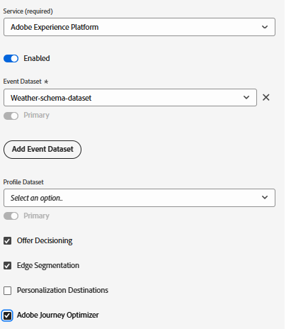

# XDM-schema, gegevensset en gegevensstroom instellen in AEP

## XDM-schema maken

Om Adobe Experience Platform Web SDK (Alloy.js) op een Web-pagina te gebruiken, moeten de Markeringen van AEP met een Datasstream worden geassocieerd die aan een XDM- Gebeurtenisschema in kaart wordt gebracht. Het Web SDK (alloy.sendEvent) verzendt gegevens naar AEP als Gebeurtenissen van de Ervaring, die met een schema moeten in overeenstemming zijn XDM dat op de klasse XDM ExperienceEvent wordt gebaseerd.

Een XDM-schema maken

* Aanmelden bij Adobe Experience Platform
* Gegevensbeheer -> Schema&#39;s -> Schema maken

* Creeer een XDM gebeurtenis gebaseerd schema genoemd **_Weer-Schema_**. Als u niet vertrouwd met het creëren van een schema bent, te volgen gelieve deze [ documentatie ](https://experienceleague.adobe.com/en/docs/experience-platform/xdm/tutorials/create-schema-ui)

* Zorg ervoor dat het schema de volgende gebieden met aangewezen gegevenstype heeft.

## Creeer een Dataset die op het Schema wordt gebaseerd

A **dataset in Adobe Experience Platform (AEP)** is een gestructureerde opslagcontainer die wordt gebruikt om, gegevens in te voeren op te slaan en te activeren die op een bepaald schema XDM worden gebaseerd.

* Gegevensbeheer -> Datasets -> Gegevensset maken
* Creeer een dataset genoemd **_Weer-schema-dataset_** die op het XDM schema (_&#x200B;**wordt gebaseerd Weer-Schema**&#x200B;_) in de vorige stap wordt gecreeerd.

## Een DataStream maken

Een gegevensstroom in Adobe Experience Platform is vergelijkbaar met een beveiligde pijplijn (of snelweg) die uw website of toepassing verbindt met Adobe-services, waardoor gegevens kunnen worden ingevoerd en inhoud op maat kan worden teruggestroomd.

* Navigeer naar Gegevensverzameling > Gegevensstromen en klik vervolgens op Nieuwe gegevensstroom. Noem de datastream **weer-verwant-datastream**

* Geef de volgende details op, zoals hieronder in de schermafbeelding wordt weergegeven
  
* Klik op Opslaan, klik vervolgens op Toewijzing toevoegen en voeg de Adobe Experience Platform-service en de Dataset van de gebeurtenis toe met de desbetreffende selectievakjes ingeschakeld
  

* Sla de gegevensstroom op.
