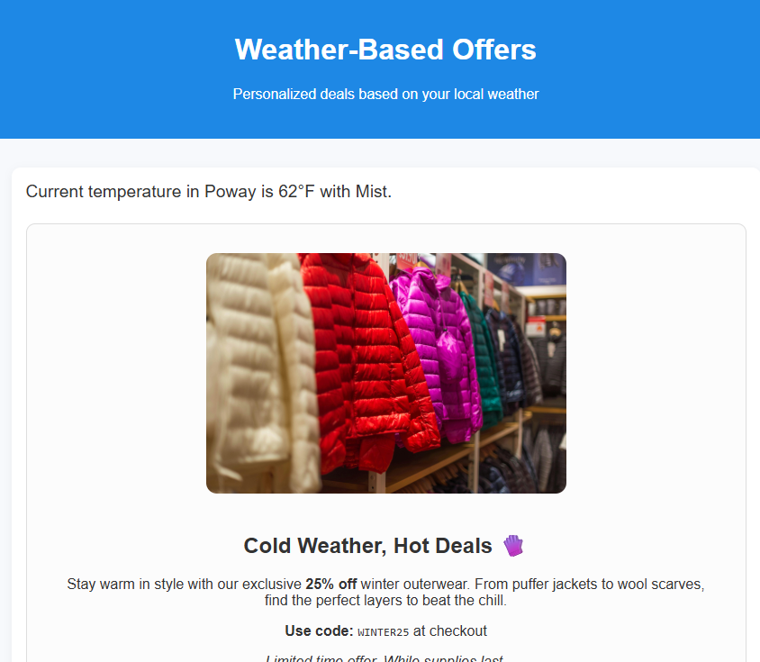

# Omschrijving hoofdletter gebruiken

Het gebruiken van aan het weer gerelateerde gegevens in Adobe Journey Optimizer (AJO) om aanbiedingen te dienen staat ondernemingen toe om klantenervaringen te personaliseren die op real-time milieuomstandigheden worden gebaseerd. Weer is een krachtig contextueel signaal. De behoeften en het gedrag van mensen veranderen afhankelijk van het weer. Door weergegevens te gebruiken:

Verstrek relevante aanbiedingen die zich aan klantenstemming en milieu richten

Op een warme dag, toon een aanbieding voor koude drank of AC eenheden. Op een regenachtige dag jassen of paraplu&#39;s promoten

Voorbeeld van een op weersomstandigheden gebaseerde aanbieding

## Voorwaarden voor deze zelfstudie

* Toegang tot Experience Platform

* Basisbegrip van Adobe Experience Platform-tags

* Basiskennis van Experience Platform-concepten (profielen, soorten publiek, gegevenssets)

* Kennis van Journey Optimizer

* Basiskennis van JavaScript (eenvoudige functies lezen en schrijven)

* Mogelijkheid om Browser DevTools te gebruiken (tabbladen Console en Netwerk)
