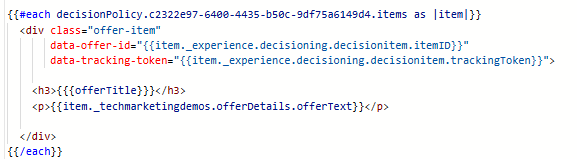
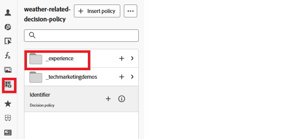

# Trackingtokens toevoegen om objecten aan te bieden

Voer de volgende stappen uit om de code in de personalisatie-editor te wijzigen:

Navigeer aan _&#x200B;**beheer van de Reis ->Campagnes**&#x200B;_

Open de aangewezen campagne en klik de _&#x200B;**campagne van het Einde**&#x200B;_ knoop om de campagne tegen te houden.

Open de tegengehouden campagne en klik op _&#x200B;**wijzigen campagne**&#x200B;_ knoop.

Klik op _&#x200B;**Inhoud**&#x200B;_ lusje en klik dan op _&#x200B;**geef code**&#x200B;_ knoop uit om de verpersoonlijkingsredacteur te openen.

Twee nieuwe gegevenskenmerken aan de div toevoegen, zoals wordt weergegeven in de schermafbeelding

TrackingToken en ItemID kunnen worden toegevoegd door op het pictogram van het Beleid van het Besluit in de linkernavigatie te klikken en onderaan de beslissingsboom te boren itemID en trackingToken te selecteren.

Op deze manier zorgt u ervoor dat elk gerenderde aanbod een token voor het bijhouden van gegevens bevat. Dit is essentieel voor een nauwkeurige indruk en het bijhouden van gebeurtenissen.

Sla de wijzigingen op en activeer de campagne.
