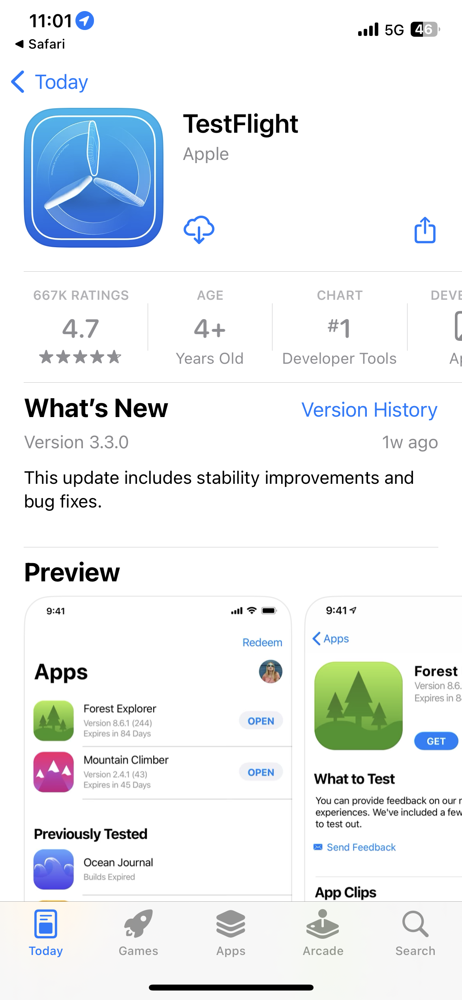
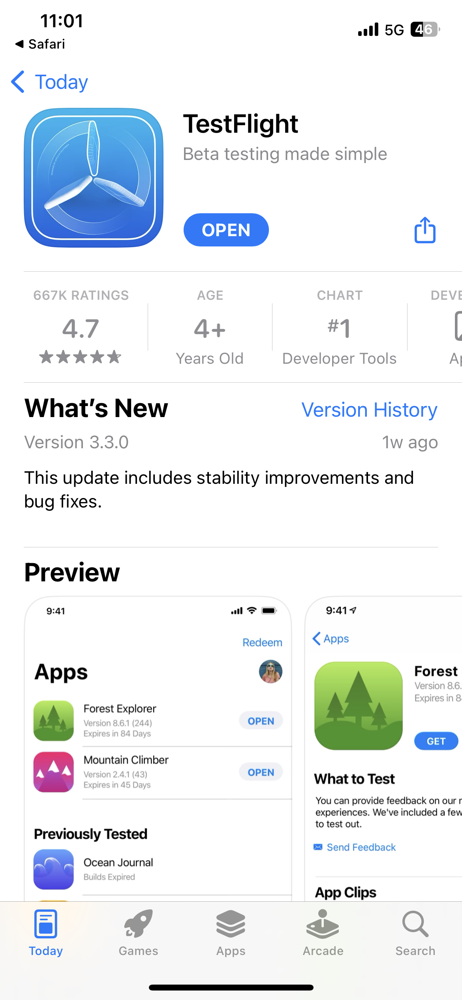

# Top Lab L731 - Cheat Sheet

Deze pagina bevat tekst en koppelingen die worden gebruikt in het Lab van de L731-top. Hiermee kunt u de inhoud naar Journey Optimizer-berichten kopiëren en plakken.

## Oefening 1.1 - De app downloaden en installeren

Scan de QR-code om de app te downloaden

>[!BEGINTABS]

>[!TAB iOS]

>[!IMPORTANT]
>
>Sluit TestFlight-app en scan nogmaals de QR-code als u om de inwisselingscode wordt gevraagd.
>
>Meldingen toestaan.
>

U wordt gevraagd Testflight, stappen 1 tot en met 4, te installeren. Nadat u Testflight hebt geïnstalleerd, voert u de stappen 5 tot en met 8 uit om de Las van Vegas te installeren:

<table>
<tr>
</tr>
<tr>
<td>
 

      

      <b>Stap 1 </b>
      

      
      

  </td>
  <td>
 

      

      <b>Stap 2 </b>
      

      
      

  </td>
  <td>
 

      

      <b>Stap 3 </b>
      

      
      

  </td>
  <td>
 

      

      <b>Stap 4 </b>
      

      
      

  </td>
  </tr>
  <tr>
<td>
 

      

      <b>Stap 5 </b>
      

      
      

  </td>
  <td>
 

      

      <a>
      <b>Stap 6 </b>
      

        
      </a>
      

  </td>
  <td>
 

      

      <a>
      <b>Stap 7 </b>
      

        
      </a>
      

  </td>
  <td>
 

      

      <a>
      <b>Stap 8 </b>
      

        
      </a>
      

  </td>
  </tr>
</table>

>[!TAB Android]

Aangezien de app niet bij de Google Play Store is geregistreerd, ontvangt u een waarschuwingsbericht:

Klikken **Toch installeren**

>[!ENDTABS]

## Oefening 1: Aanmelden bij Adobe Journey Optimizer

[Klik hier om u aan te melden bij Journey Optimizer](https://experience.adobe.com/#/@techmarketingdemos/sname:summit-2023-ajo-lab/journey-optimizer/home){target="_blank"}

**Aanmeldingsgegevens**

* **Gebruikersnaam:** `L731+<your seat number>@summitlab.us` (voorbeeld: L731+001@summitlab.us)
* **Wachtwoord:** Adobe 2023!

## Oefening 2 Een campagne in de app maken

| Sectie | Veld | Tekst | Koppelingen |
|----|----|----|----|
| **Eigenschappen** | Campagnenaam | `<your seat number> Vegas Stay Campaign` |  |
| **Triggers** | Staat | oplichten |  |
| **Inhoud bewerken:** Media | Media-URL, optie |  | https://i.ibb.co/NstLhjW/Firefly-Poster-with-heading-Adobe-Max-84773.jpg |
| **Inhoud bewerken:** Inhoud | Titel | Haal je vroege vogelkorting op! |  |
| **Inhoud bewerken:** Inhoud | Lichaam | Adobe Max keert terug naar Las Vegas. Bereid u voor op inspirerende luidsprekers, sessies die de vaardigheden uitbreiden en nieuwe verbindingen. Boek nu uw suite en krijg 10% korting. |  |
| **Inhoud bewerken:** Knoppen | Knop | Ontvang je korting van 10%! | lab://booking?suite=presidential&amp;discount=10 |
| **Inhoud bewerken:** Knoppen | Interactie | CTA in de app |  |
| **Voorvertonen op apparaat** | Basis-URL die moet worden gebruikt voor voorvertoning op apparaat |  | **iOS:** lab://  **Android**: https://lab |

## Oefening 3: een pushmelding maken

| Veld | Tekst | Koppelingen |
|----|----|----|
| Campagnenaam | **`<your seat number> Max Push Campaign`** |  |
| Titel | Hé! |  |
| Lichaam | Wist je dat Adobe Max terugkomt naar Vegas. Boek nu uw ruimte en profiteer van 10% korting. |  |
| Media-URL, optie |  | https://i.ibb.co/1M0BnZn/Firefly-Big-conference-big-stage-with-ADBE-text-on-screen-40178.jpg |
