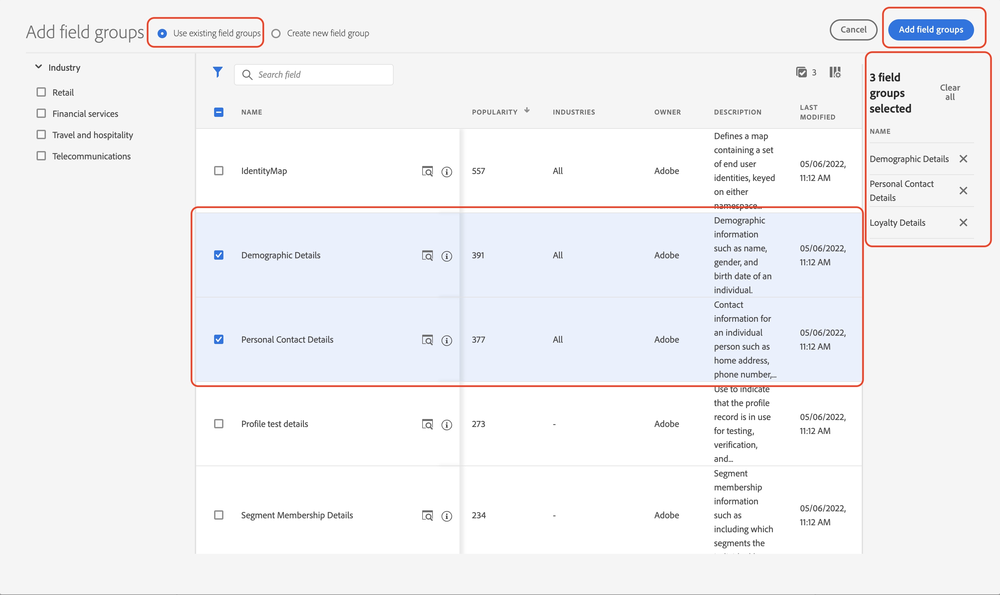
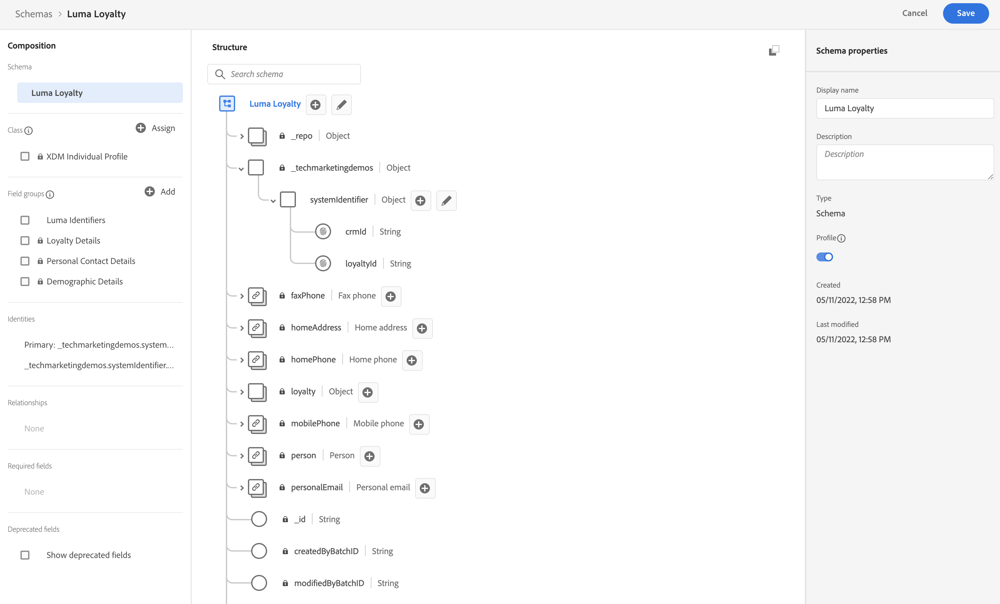

# Gegevens handmatig instellen

In deze sectie maakt u de vereiste naamruimten en definieert u de [!DNL Luma] de structuur van steekproefgegevens door te creëren [[!UICONTROL schema&#39;s]](https://experienceleague.adobe.com/docs/experience-platform/xdm/schema/composition.html).

>[!TIP]
>De videozelfstudie bekijken [Identiteiten toewijzen](/help/set-up-data/map-identities.md) voordat u begint.

## Stap 1: Naamruimten voor identiteiten maken

In deze stap maakt u naamruimten voor de [!DNL Luma] aangepaste identiteitsvelden genaamd `lumaLoyaltyId`, `lumaCrmId`, en `lumaProductSKU`. Identiteitsnaamruimten spelen een kritieke rol in de bouw van klantenprofielen in real time, aangezien twee passende waarden in zelfde namespace twee gegevensbronnen toestaan om een identiteitsgrafiek te vormen.

Begin met het maken van een [!UICONTROL namespace] voor de [!DNL Luma Loyalty ID] schema:

1. Ga in de Journey Optimizer-gebruikersinterface naar **[!UICONTROL Klant]** > **[!UICONTROL Identiteiten]** in de linkernavigatie.

1. Selecteren **[!UICONTROL Naamruimte maken]**.

1. Geef de volgende gegevens op:

   | Weergavenaam | Identiteitssymbool | Type |
   |---|---|---|
   | `Luma Loyalty ID` | `lumaLoyaltyId` | [!UICONTROL Apparaatoverschrijdende id] |

1. Selecteer **[!UICONTROL Maken]**.

   

1. Maak nog twee naamruimten na dezelfde stappen:

   | Weergavenaam | Identiteitssymbool | Type |
   |---|---|---|
   | `Luma CRM ID` | `lumaCrmId` | [!UICONTROL Apparaatoverschrijdende id] |
   | `Luma Product SKU` | `lumaProductSKU` | [!UICONTROL Id van niet-personen] |

## Stap 2: Schema&#39;s maken

In deze stap definieert u de structuur van de voorbeeldgegevens door zes [[!UICONTROL schema&#39;s]](https://experienceleague.adobe.com/docs/experience-platform/xdm/schema/composition.html):

* [[!DNL Luma Loyalty Schema]](#create-luma-loyalty-schema)

* [[!DNL Luma Product Catalog Schema]](#create-luma-product-catalog-schema)

* [[!DNL Luma Product Inventory Events] Schema](#create-luma-product-inventory-event-schema)

* [[!DNL Luma CRM Schema]](#create-luma-crm-and-luma-product-interactions-schemas)

* [[!DNL Luma Web Events Schema]](#create-luma-crm-and-luma-product-interactions-schemas)

* [[!DNL Luma Offline Purchase Events Schema]](#create-additional-schemas)

* [[!DNL Luma Test Profiles Schema]](#create-additional-schemas)

>[!TIP]
>
>Bekijk de videozelfstudie: [Een schema maken](/help/set-up-data/create-schema.md) voordat u begint.

### Maken [!DNL Luma Loyalty Schema] {#create-luma-loyalty-schema}

In deze sectie wordt beschreven hoe u de [!DNL Luma Loyalty] en configureer veldgroepen.

#### Het schema maken

1. Ga naar **[!UICONTROL GEGEVENSBEHEER]** > **[!UICONTROL Schemas]** in de linkernavigatie.

1. Selecteren **[!UICONTROL Schema maken]** rechtsboven.

1. Selecteer in het keuzemenu de optie **[!UICONTROL Afzonderlijk XDM-profiel]**.

   U selecteert deze optie omdat u kenmerken van een individuele klant modelleert (punten, status, enzovoort).

#### Bestaande veldgroepen toevoegen

Vervolgens wordt u gevraagd om met behulp van groepen veldgroepen toe te voegen aan het schema. U moet bestaande veldgroepen toevoegen en een veldgroep maken.

1. Op de [!UICONTROL Schema] pagina, als de modale veldgroepen niet automatisch zijn geopend, selecteert u **[!UICONTROL Toevoegen]**.

   

1. Op de **[!UICONTROL Veldgroepen toevoegen]** pagina, schakelt u de volgende veldgroepen in:

   * **[!UICONTROL Demografische details]** voor basisgegevens van klanten zoals naam en geboortedatum.

   * **[!UICONTROL Persoonlijke contactgegevens]** voor standaardcontactgegevens zoals e-mailadres en telefoonnummer.

   * **[!UICONTROL Loyalty-details]** voor de loyaliteitsdetails zoals punten, verbonden datum, of status. De groep van het loyaliteitsgebied is ver onderaan de lijst, zodat is het het gemakkelijkst om naar het te zoeken.

1. Selecteren **[!UICONTROL Veldgroep toevoegen]** om alle drie gebiedsgroepen aan het schema toe te voegen.

   

1. Selecteer het bovenste knooppunt van het schema.

1. Enter `Luma Loyalty Schema` als de **[!UICONTROL Weergavenaam]**.

#### Een [!UICONTROL veldgroep] {#create-field-group}

Om consistentie over de schema&#39;s te verzekeren, adviseert Adobe het beheren van alle systeemherkenningstekens in één enkele groep:

1. Van de **[!UICONTROL Samenstelling]** deel onder [!UICONTROL Veldgroepen], selecteert u **[!UICONTROL Toevoegen]**.

1. Selecteren **[!UICONTROL Nieuwe veldgroep maken]**.

1. Toevoegen `Luma Identity Profile Field Group` als de **[!UICONTROL Weergavenaam]**.

1. Toevoegen `system identifiers for XDM Individual Profile class` als de **[!UICONTROL Beschrijving]**.

1. Selecteren **[!UICONTROL Veldgroepen toevoegen]**.

   

#### Velden toevoegen aan de nieuwe [!UICONTROL veldgroep]

De nieuwe, lege veldgroep wordt toegevoegd aan uw schema. Met de knoppen + kunt u nieuwe velden toevoegen aan elke locatie in de hiërarchie. In dit geval moet u velden toevoegen op het hoofdniveau:

1. Selecteren **[!UICONTROL +]** naast de naam van het schema.

   Met deze stap voegt u een veld onder toe **uw huurder** naamruimte, om conflicten te beheren tussen uw aangepaste velden en standaardvelden.

1. In de **[!UICONTROL Veldeigenschappen]** zijbalk voegt u de details van het nieuwe veld toe:

   * **Veldnaam:** `systemIdentifier`

   * **[!UICONTROL Weergavenaam]:** `System Identifier`

   * **Type:** Object

   * **[!UICONTROL Veldgroep toewijzen]:** [!DNL Luma identifiers]

1. Selecteren **[!UICONTROL Toepassen]**.

   

   Twee velden toevoegen onder de `systemIdentifier` object:

   | [!UICONTROL Veldnaam] | [!UICONTROL Weergavenaam] | [!UICONTROL Type] |
   |-------------|-----------|----------|
   | `loyaltyId` | `Loyalty Id` | [!UICONTROL Tekenreeks] |
   | `crmId` | `CRM Id` | [!UICONTROL Tekenreeks] |

#### Identiteiten instellen

U hebt nu de [!UICONTROL namespace] en de [!DNL Luma Loyalty schema] geconfigureerd. Voordat u gegevens kunt invoeren, moet u de identiteitsvelden een label geven. Elk schema gebruikt met [!UICONTROL Klantprofiel in realtime] moet een primaire identiteit hebben opgegeven en elke opgenomen record moet een waarde voor dat veld hebben.

1. Stel de **primaire identiteit**:

   Van de **[!DNL Luma Loyalty Schema]**:

   1. Selecteer **[!DNL Luma Identity Profile Field Group]**.

   2. Selecteer **[!DNL loyaltyId]** veld.

   3. In de **[!UICONTROL Veldeigenschappen]** de **[!UICONTROL Identiteit]** doos.

   4. De optie **[!UICONTROL Primaire identiteit]** doos.

   5. Selecteer `Luma Loyalty Id` naamruimte van **[!UICONTROL Identiteitsnaamruimten]** vervolgkeuzemenu.

   6. Selecteren **[!UICONTROL Toepassen]**.

      

2. Een **secundaire identiteit**:

   Van de **[!DNL Luma Loyalty Schema]**:

   1. Selecteer **[!DNL Luma Identity Profile Field Group]**.

   2. Selecteer `crmId` veld.

   3. In de **[!UICONTROL Veldeigenschappen]** de **[!UICONTROL Identiteit]** doos.

   4. Selecteer `Luma CRM Id` naamruimte van **[!UICONTROL Identiteitsnaamruimten]** vervolgkeuzelijst.

   5. Selecteren **[!UICONTROL Toepassen]**.

#### Inschakelen voor profiel en schema opslaan

1. Selecteer het bovenste knooppunt van het schema.

1. In de [!UICONTROL Veldeigenschappen], enable **[!UICONTROL Profiel]**.

   Het schema moet er als volgt uitzien:

   

1. Selecteren **[!UICONTROL Opslaan]**.

### Maken [!DNL Luma Product Catalog Schema] {#create-luma-product-catalog-schema}

1. Ga naar **[!UICONTROL GEGEVENSBEHEER]** > **[!UICONTROL Schemas]** in de linkernavigatie.

1. Selecteren **[!UICONTROL Schema maken]** (rechtsboven).

1. Als u een klasse wilt maken, selecteert u **[!UICONTROL Bladeren door alle schematypen]** in het keuzemenu.

1. Selecteren **[!UICONTROL Nieuwe klasse maken]**.

1. Voeg de weergavenaam toe: `Luma Product Catalog Class`.

1. Klasse toewijzen.

1. Een [!UICONTROL Veldgroep]:

   * Weergavenaam: `Luma Product Catalog Field Group`

1. Voeg het volgende veld toe aan de **[!DNL Luma Product Catalog Field Group]**.

   * Veldnaam: `product`

   * Weergavenaam: `Product`

   * Type: [!UICONTROL Object]

   * Veldgroep: [!DNL Luma Product Catalog Field Group]

1. Selecteren **[!UICONTROL Toepassen]**.

1. Voeg de volgende velden toe aan de **[!DNL Product]** object:

   | [!UICONTROL Veldnaam] | [!UICONTROL Weergavenaam] | [!UICONTROL Type] |
   |-------------|-----------|----------|
   | `sku` | `Product SKU` | [!UICONTROL Tekenreeks] |
   | `name` | `Product Name` | [!UICONTROL Tekenreeks] |
   | `category` | `Product Category` | [!UICONTROL Tekenreeks] |
   | `color` | `Product Color` | [!UICONTROL Tekenreeks] |
   | `size` | `Product Size` | [!UICONTROL Tekenreeks] |
   | `price` | `Product Price` | [!UICONTROL Dubbel] |
   | `description` | `Product Description` | [!UICONTROL Tekenreeks] |
   | `imageUrl` | `Product Image URL` | [!UICONTROL Tekenreeks] |
   | `stockQuantity` | `Product Stock Quantity` | [!UICONTROL Tekenreeks] |
   | `url` | `Product URL` | [!UICONTROL Tekenreeks] |

1. Stel de **[!DNL SKU]** als primaire identiteit.
1. Voeg de **[!UICONTROL Weergavenaam]** `Luma Product Catalog Field Group` aan de [!UICONTROL veldgroep].

1. Selecteren **[!UICONTROL Opslaan]**.

### Maken [!DNL Luma Product Inventory Event Schema] {#create-luma-product-inventory-event-schema}

1. Ga naar **[!UICONTROL GEGEVENSBEHEER]** > **[!UICONTROL Schemas]** in de linkernavigatie.

1. Selecteer **[!UICONTROL Schema maken]** aan de rechterbovenzijde.

1. Selecteer in het vervolgkeuzemenu de optie **[!UICONTROL Bladeren door alle schematypen]**.

1. Selecteren **[!UICONTROL Nieuwe klasse maken]**.

1. Voeg de weergavenaam toe: `Luma Business Event Class`.

1. Selecteer type: *[!UICONTROL Tijdreeksen]*.

1. Klasse toewijzen.

1. Een [!UICONTROL veldgroep]:

   * Weergavenaam: `Luma Product Inventory Event Details Field Group`

1. Voeg de **[!UICONTROL Weergavenaam]** `Luma Product Inventory Event Schema` naar het schema.

1. Voeg het volgende veld toe aan de **[!DNL Luma Product Inventory Event Details Field Group]**:

   * Veldnaam: `inventoryEvent`

   * Weergavenaam: `Inventory Event`

   * Type: [!UICONTROL Object]

   * Veldgroep: `Luma Product Inventory Event Details Field Group`

1. Voeg de volgende velden toe aan de `Product Inventory Event Details` object:

   | [!UICONTROL Veldnaam] | [!UICONTROL Weergavenaam] | [!UICONTROL Type] |
   |-------------|-----------|----------|
   | `sku` | `SKU` | [!UICONTROL Tekenreeks] |
   | `stockEventType` | `Stock Event Type` | [!UICONTROL Tekenreeks] |

   1. om de `stockEventType` aan Enum, uitgezochte type: `string`.

   2. Omlaag schuiven naar de onderkant van het dialoogvenster **[!UICONTROL Veldeigenschappen]**.

   3. Inschakelen **[!UICONTROL Enum]**.

   4. Enter **[!UICONTROL waarden] ([!UICONTROL label)]**: `restock` (`Restock`).

   5. Selecteren **[!UICONTROL Rij toevoegen]**.

   6. Enter **[!UICONTROL waarden] ([!UICONTROL label)]**: `outOfStock` (`Out of Stock`).

   7. Selecteren **[!UICONTROL Toepassen]**.

      

1. Set `inventory.Event.sku` veld als **[!UICONTROL primaire identiteit]** met de **[!DNL LumaProductSKU namespace]**.

1. Selecteer `sku` en een relatie met de `product.sku` in het **[!DNL Luma Product catalog Schema]** Schema:

   1. Omlaag schuiven naar de onderkant van het dialoogvenster **[!UICONTROL Veldeigenschappen]**.

   2. Inschakelen **[!UICONTROL Relatie]**.

      1. **[!UICONTROL Referentieschema]**: [!DNL Luma Product Catalog Schema].

      2. **[!UICONTROL Naamruimte van verwijzing]**: [!DNL LumaProductSKU].

   3. Selecteren **[!UICONTROL Toepassen]**.

      Het schema moet er als volgt uitzien:

      

1. Inschakelen voor **Profiel**.

1. Selecteren [!UICONTROL Opslaan] om het schema op te slaan.

### Aanvullende schema&#39;s maken {#create-additional-schemas}

Maak de volgende aanvullende [!UICONTROL schema&#39;s]:

| [!UICONTROL Weergavenaam] | [!DNL Luma CRM Schema] | [!DNL Luma Web Events Schema] | [!DNL Luma Test Profiles schema] | [!DNL Luma Offline Purchase Events Schema] |
|  ---| ------- | ---- |----|----|
| **[!UICONTROL Klasse]** | [!UICONTROL Afzonderlijk XDM-profiel] | [!UICONTROL XDM Experience Event] | [!UICONTROL Afzonderlijk XDM-profiel] | [IUICONTROL XDM ExperienceEvent] |
| **[!UICONTROL Bestaande veldgroep toevoegen]** | `Luma Identity Profile Field Group` `Demographic Details` `Personal Contact Details` | `Orchestration eventID` `Consumer Experience Event` `AEP Web SDK ExperienceEvent` | `Luma Identity Profile Field Group` `Demographic Details` `Personal Contact Details` `Profile test details` | `Luma Identity Profile Field Group`  `Commerce Details` |
| **[!UICONTROL Relatie]** |  | `productListItems.SKU`:  Referentieschema `Luma Product Catalog Schema`  [!DNL Reference identity namespace] `lumaProductSKU` |  | `productListItems.SKU`:  Referentieschema `Luma Product Catalog Schema`  [!DNL Reference identity namespace] `lumaProductSKU` |
| **[!UICONTROL Primaire identiteit] [!UICONTROL namespace])** | `systemIdentifier.crmId` | | `systemIdentifier.crmId` | `systemIdentifier.LoyaltyId` |
| **[!UICONTROL Inschakelen voor profiel]** | ja | ja | ja | ja |

## Volgende stappen

Nu u de gegevensstructuur hebt gemaakt, kunt u [gegevenssets maken en voorbeeldgegevens opnemen](/help/tutorial-configure-a-training-sandbox/manual-data-ingestion.md).
