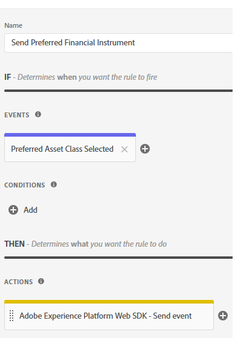

# Adobe Experience Platform-tags maken

Met Adobe Experience Platform Tags (voorheen Adobe Launch) kunt u marketing- en analysetechnologieën* op uw website beheren en implementeren zonder dat u de code van de site hoeft te wijzigen.

Deze [&#x200B; video beschrijft het proces om de Markeringen van de Ervaring van Adobe te creëren &#x200B;](https://experienceleague.adobe.com/nl/playlists/experience-platform-get-started-with-tags)

* Aanmelden bij gegevensverzameling
* Klik op Labels -> Nieuwe eigenschap
* Maak een Adobe Experience Platform-tag met de naam Financial Advisors.

* De volgende extensies toevoegen aan de tag
  

* Zorg ervoor om het Web SDK van Adobe Experience Platform te vormen om het correcte milieu en de Financiële Advisors DataStream te gebruiken die in de vroegere stap wordt gecreeerd.
  

* Er is geen aanvullende configuratie nodig voor Adobe Client Data Layer en Core-extensies

## Gegevenselementen maken

Gegevenselementen worden gebruikt om gegevens te verzamelen, te organiseren en te leveren over webgebaseerde marketing- en advertentietechnologie.

De volgende gegevenselementen maken

| Elementnaam | Extensie | Type gegevenselement | Aanvullende opmerkingen |
|------------------------------|-----------------------------------|-------------------|------------------------------------------------------------------------------------------------------------------------------------------------------------------|
| PreferredFinancialInstrument | Kern | Aangepaste code | Zie de onderstaande opmerking |
| XDM-object | Adobe Experience Platform Web SDK | XDM-object | Selecteer uw milieu en het Schema van Financiële Advisors |


Voor de aangepaste code opent u de code-editor en kopieert en plakt u de volgende code

```javascript
return window.adobeDataLayer
  ?.slice()
  .reverse()
  .find(event => event.event === "assetClassSelection")
  ?.xdm?.FinancialInterest?.PreferredFinancialInstrument || "undefined";
```

## Codeuitleg

Bekijk de array adobeDataLayer (waarin gebeurtenissen op uw webpagina worden opgeslagen).

Maak een kopie van de array met behulp van.slice(), zodat het origineel niet wordt gewijzigd.

Keer de volgorde van de gebeurtenissen om eerst de nieuwste gebeurtenissen te controleren.

Zoek de eerste gebeurtenis (vanaf de nieuwste gebeurtenis) waarbij event.event precies &quot;assetClassSelection&quot; is.

Indien gevonden, ga in de xdm gegevens van die gebeurtenis en krijg de waarde van FinancialInterest.PreferredFinancialInstrument.

Retourneer de tekenreeks &quot;undefined&quot; als er niets is gevonden.


## Regel maken

Met de Rule Builder in Adobe Experience Platform-tags kunt u bepalen wanneer en hoe specifieke handelingen op uw website moeten worden uitgevoerd op basis van gebruikersgedrag of -gebeurtenissen.

* Maak een regel met de naam Send Preferred Financial Instrument. Deze regel bevat een gebeurtenis en een handeling


* Maak een gebeurtenisconfiguratie met de naam Preferred Asset Class Selected, zoals hieronder wordt weergegeven. Deze gebeurtenis luistert naar gebeurtenissen assetClassSelection.
  


* Een handeling maken om het bijgewerkte XDM-schema naar AEP te verzenden
  

* Je laatste regel moet er hieronder uitzien
  

## AEP-tags maken en implementeren


Maak een nieuwe bibliotheek en voeg alle gewijzigde bronnen aan de bibliotheek toe, zoals geïllustreerd in de onderstaande schermafbeeldingen.

Bibliotheek toevoegen


Een bibliotheek maken

Geef in het scherm Bibliotheek maken de naam van de bibliotheek en de omgeving op.
U moet alle gewijzigde bronnen toevoegen aan deze bibliotheek


Klik vervolgens op de knop Opslaan en bouwen naar ontwikkeling om de bibliotheek te maken

## AEP-tags opnemen op de HTML-pagina

Wanneer u een AEP-eigenschap Tags publiceert, geeft Adobe u een scripttag die u in de HTML ``` <head>``` -tags of onder aan de ``` <body>``` -tags moet plaatsen.

* Ga naar de eigenschap Tags (Financial Advisors).

* Klik op Milieu&#39;s en klik het installatiepictogram van het milieu u wilt (bijvoorbeeld, Ontwikkeling, het Staging, Productie).

* Noteer de ingesloten code. Dit is nodig in een later stadium van deze zelfstudie.
