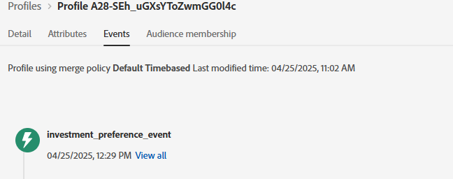

# De oplossing testen

Als u uw implementatie wilt valideren, begint u met het openen van de webpagina die uw voorkeursformulier bevat. Gebruik de DevTools (de lusjes van de Console en van het Netwerk) van browser om het proces van de vormvoorlegging te controleren. Nadat u een voorkeur hebt verzonden (door bijvoorbeeld &quot;Stocks&quot; te selecteren), controleert u of de AEP Web SDK (alloy.sendEvent) is geactiveerd en of de juiste gegevens naar Adobe Experience Platform zijn verzonden. Navigeer in AEP naar de sectie Soorten publiek en controleer of uw profiel binnen enkele ogenblikken geschikt is voor het verwachte publiek (bijvoorbeeld &#39;Interested in Stocks&#39;) met Edge Segmentation. U kunt de inkomende gebeurtenisgegevens in de bijbehorende dataset ook inspecteren om ervoor te zorgen het de correcte voorkeurswaarde bevat. Herhaal dit proces voor elke activaklasse (Voorraden, Obligaties, CD&#39;s) om ervoor te zorgen dat de volledige workflow correct werkt.

## Tips voor het oplossen van problemen

Als u niet ziet dat het profiel direct in aanmerking komt voor het beoogde publiek, controleert u het volgende:

### Adobe-gegevenslaag valideren

* De ontwikkelaarsgereedschappen van de browser openen → Console
* Type console.log(window.adobeDataLayer);
* Bevestig dat een gebeurtenis met de gebeurtenis &quot;assetClassSelection&quot; en de juiste PreferredFinancialInstrument-waarde na de indiening van het formulier worden weergegeven

### Uitvoering van opstartregel bevestigen

* Adobe Experience Platform Debugger openen (Chrome Extension)
* Aanmelden bij de foutopsporing
* Het formulier verzenden
* Controleer of de gebeurtenis DataPushed voor assetClassSelection is vastgelegd

De volgende debugger screenshot zou u moeten helpen

### De ECID ophalen

De ECID (Experience Cloud-id) is een unieke, permanente Adobe-id die wordt gebruikt om gebruikers in Experience Cloud-oplossingen en -sessies te herkennen en te verenigen.

* Chrome Developer Tools → Het tabblad Netwerk

* Filteren op &quot;interactie&quot; of &quot;verzamelen&quot;

* Het formulier verzenden
* Klik op het tabblad Reactie en noteer de ECID

### Real-time profiel en kwalificatie van publiek controleren

* Aanmelden bij Journey Optimizer
* Ga naar Klanten->Profielen->Bladeren
* Zoek naar ECID u van de vorige stap zoals aangetoond in het het schermschot kreeg
  
* Klik op het profiel en selecteer het tabblad Gebeurtenissen om te controleren of Investment_preferent_event wordt weergegeven
  
* Open de json die aan de gebeurtenis is gekoppeld en controleer of deze de juiste gebeurtenisgegevens bevat.

### Aanvullende tips voor probleemoplossing

* Zorg ervoor dat het schema en het datasetprofiel worden toegelaten.
* Zorg ervoor dat de Segmentatie van Edge voor het publiek wordt toegelaten zodat de kwalificatie in bijna real time gebeurt.
* Het wachten van een paar minuten en het verfrissen van de mening van het publiek kunnen ook helpen, vooral als het testen direct na het publiceren veranderingen.
* Zorg ervoor dat de publieksregels correct zijn gedefinieerd en dat er wordt verwezen naar de exacte veldnamen en waarden die zijn vastgelegd bij het verzenden van het formulier.
