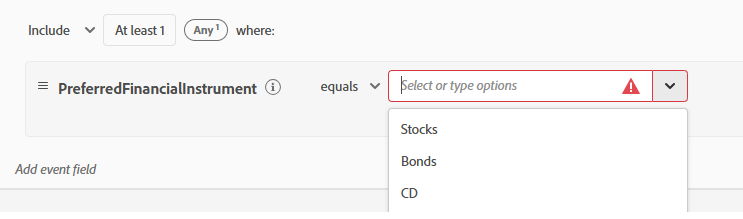

# XDM-schema&#39;s, gegevensset, gegevensstroom en soorten publiek instellen in AEP

* Aanmelden bij Adobe Experience Platform

* Creeer een XDM gebeurtenis gebaseerd schema genoemd Financiële Advisors in Journey Optimizer. Als u niet vertrouwd met het creëren van een schema bent, te volgen gelieve deze [ documentatie ](https://experienceleague.adobe.com/en/docs/experience-platform/xdm/tutorials/create-schema-ui)

* Voeg de volgende structuur aan uw schema toe. In het PreferredFinancialInstrument-element wordt de voorkeur van de gebruiker voor voorraden, obligaties, cd opgeslagen
  

* Het PreferredFinancialInstrument-element heeft opsommingswaarden die hieronder zijn gedefinieerd
  

* Controleer of het schema is ingeschakeld voor het profiel.

## Creeer een Dataset die op het Schema wordt gebaseerd

A **dataset in Adobe Experience Platform (AEP)** is een gestructureerde opslagcontainer die wordt gebruikt om, gegevens in te voeren op te slaan en te activeren die op een bepaald schema XDM worden gebaseerd.

* Creeer een dataset genoemd _de gegevensreeks van Advisors van de Financiële_ die op het schema XDM (Financiële Advisors) wordt gebaseerd die in de vorige stap wordt gecreeerd.

* Zorg ervoor dat de dataset voor profiel wordt toegelaten

## Een DataStream maken

Een gegevensstroom in Adobe Experience Platform is vergelijkbaar met een beveiligde pijplijn (of snelweg) die uw website of toepassing verbindt met Adobe-services, waardoor gegevens kunnen worden ingevoerd en inhoud op maat kan worden teruggestroomd.

* Ga naar AEP > Datastreams en klik vervolgens op Nieuwe gegevensstroom. Noem de datastream _Financiële Advisors DataStream_

* Geef de volgende details op, zoals hieronder in de schermafbeelding wordt weergegeven
  
* Klik op Opslaan, klik vervolgens op Toewijzing toevoegen en voeg de Adobe Experience Platform-service en de Dataset van de gebeurtenis toe zoals deze worden weergegeven
  

* Kies de aangewezen (vroeger gecreeerd) dataset van de gebeurtenisdataset.

* De gegevensstroom opslaan

## Soorten publiek maken

Soorten publiek in Adobe Experience Platform zijn groepen gebruikers die zijn gemaakt op basis van hun handelingen, voorkeuren of profielgegevens voor persoonlijke ervaringen.

* Ga naar Klant -> Soorten publiek
* Creeer Publiek gebruikend de methode van de Regel van de Bouwstijl

* Maak de volgende 3 soorten publiek in AJO met behulp van het PreferredFinancialInstrument-element uit het gebeurtenisschema.

   * Klanten die geïnteresseerd zijn in voorraden

   * Klanten die geïnteresseerd zijn in obligaties

   * Klanten die geïnteresseerd zijn in cd

Zorg ervoor dat de evaluatiemethode voor elk publiek aan Edge voor kwalificatie in real time wordt geplaatst.

De volgende schermafbeeldingen moeten u helpen bij het maken van het publiek.

