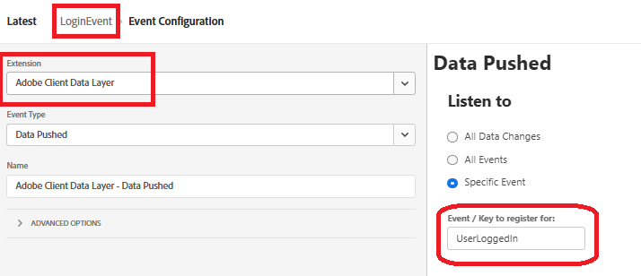

# CRMID naar Adobe Experience Platform verzenden

Adobe Experience Platform-tags worden gebruikt om de CRMID naar Adobe Experience Platform (AEP) te verzenden, omdat deze een flexibel, gebeurtenisgestuurd mechanisme biedt voor het rechtstreeks verzenden van identiteitsgegevens vanuit de browser. Als u CRMID na gebruikersaanmelding verzendt, kan AEP de anonieme ECID koppelen aan het bekende CRM-profiel, zodat u een nauwkeurige identiteitscontrole kunt instellen. Deze koppeling vormt de basis voor het samenstellen van uniforme klantprofielen, het kwalificeren van doelgroepen en het aanbieden van persoonlijke realtime ervaringen in Adobe Journey Optimizer (AJO).

Een bezit van de Markeringen van Experience Platform genoemd _&#x200B;**FinWise**&#x200B;_ wordt gecreeerd. De volgende extensies zijn toegevoegd aan de eigenschap Tags

Configureer de AEP Web SDK-extensie met gebruik van de DataStream voor financiële adviseurs die in de vorige stap is gemaakt.
Experience Cloud ID Service is een optionele extensie die voor foutopsporingsdoeleinden aan de eigenschap tag wordt toegevoegd.

## Taggegevenselementen

De volgende gegevenselementen maken

| Gegevenselement | Extensie | Type gegevenselement | Aangepaste instellingen |
|--------------|-----------------------------------|---------------------------|----------------------------------------|
| crmid | Adobe Client Data Layer | Status Gegevenslaag berekend | user.crmid |
| ECID | Experience Cloud ID Service | ECID |                                        |
| identiteit | Adobe Experience Platform Web SDK | Identiteitskaart |  |
| XDMVariable | Adobe Experience Platform Web SDK | Variabele |  |

## Regel maken

Maak een regel met de naam LoginEvent met de volgende gebeurtenis en handelingen

Gebeurtenis

Variabele bijwerken, actie

Gebeurtenisactie verzenden

## Opslaan en samenstellen

Sla uw wijzigingen op, maak en maak de bibliotheek.
