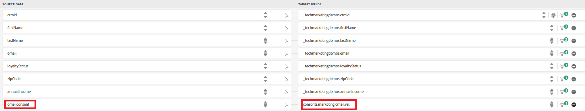

# Voorbeeldgegevens van CRM importeren in AEP-profielgegevensset

Als u wilt beginnen met identiteitstitching, importeert u voorbeeld-CRM-profielgegevens in een gegevensset die is gekoppeld aan een profielschema in Adobe Experience Platform

## Een aangepaste naamruimte maken

* Ga naar Klant -> Identiteiten -> Naamruimte maken
* Selecteer Individuele apparaat-id en geef de weergavenaam en het identiteitssymbool op, zoals in de onderstaande schermafbeelding wordt weergegeven.
  

## Een schema met profielinstellingen maken

Creeer een individueel profielschema genoemd **_FinWiseProfileSchema_**. Neem velden op, zoals annualIncome, email,firstName,lastName en loyaltyStatus.
Voeg een identiteitsgebied **_toe midden_** zoals getoond. Markeer het crmid-veld als identiteit en primair.
Voeg de _&#x200B;**Inhoud en de Details van de Voorkeur**&#x200B;_ gebiedsgroep aan het schema toe. [&#x200B; de Inhoud en de Voorkeur &#x200B;](https://experienceleague.adobe.com/nl/docs/experience-platform/xdm/field-groups/profile/consents) is een standaardgebiedsgroep voor de klasse van het Profiel XDM Individual die toestemming en voorkeurinformatie voor een individuele klant vangt.De hier opgeslagen voorkeur bepaalt de communicatie voorkeur van het kanaalniveau.

## Voorbeeldgegevens voorbereiden

Werk de dummy e-mailadressen bij naar echte adressen. Deze worden later gebruikt wanneer berichten met Adobe Journey Optimizer worden verzonden. Stel de e-mailinstemming in op y om e-maillevering voor de profielen in te schakelen.

|   | crmId | firstName | lastName | email | loyaltyStatus | zipCode | jaarinkomen | emailConsent |
|---|--------|-----------|----------|-------------------------|---------------|---------|--------------|--------------|
|   | FIN001 | Alice | Wong | alice.wong@example.com | Goud | 92128 | 120000 | y |
|   | FIN002 | Bob | Smith | bob.smith@example.com | Zilver | 92126 | 85000 | y |
|   | FIN003 | Charlie | Kim | charlie.kim@example.com | Platina | 60614 | 175000 | y |
|   | FIN004 | Diana | Lee | diana.lee@example.com | Goud | 30303 | 98000 | y |
|   | FIN005 | Ethan | Bruin | ethan.brown@example.com | Brons | 75201 | 60000 | y |

## Het CSV-bestand opnemen

* Creeer een dataset genoemd **_FinWiseCustomerDataSetWithAnnualIncome_** die op **_wordt gebaseerd FinWiseProfileSchema_** in de vroegere stap wordt gecreeerd

* Ga naar Verbindingen -> Bronnen -> Lokaal systeem
* Selecteer **_Gegevens_** toevoegen onder de Lokale dossierupload. Zorg ervoor om _&#x200B;**FinWiseCustomerDataSetWithAnnualIncome**&#x200B;_ als doeldataset te selecteren.
  
* Navigeer naar het volgende scherm. Upload het [&#x200B; csv- dossier &#x200B;](assets/finwise_profiles.csv) en verifieer de afbeeldingen
  

* Klik op Voltooien om het gegevensinvoerproces te starten

## Profiel verifiëren

* Ga naar Klant ->Profielen en zoek naar FinWise CRM-id gelijk aan FIN001 of een andere geldige waarde
  
