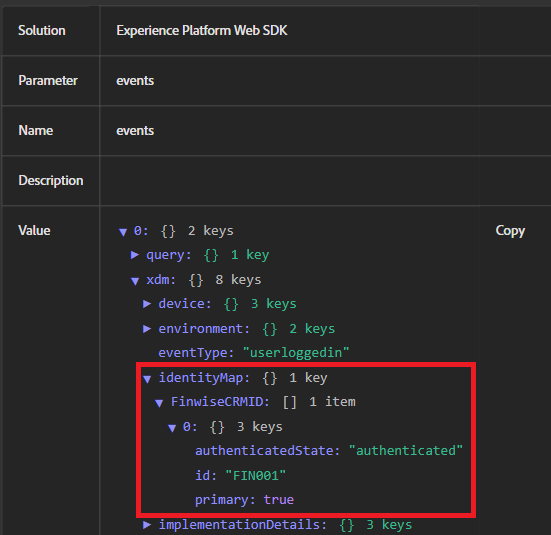

# Identiteitsstitching testen

Deze voorbeeldtoepassing simuleert een real-world login stroom waar de gebruikersgeloofsbrieven op de server worden bevestigd alvorens identiteitskaart van CRM naar Adobe Experience Platform (AEP) wordt verzonden. Een lokale server Node.js wordt gebruikt om de Web-pagina&#39;s veilig te dienen, basisauthentificatielogica te behandelen, en browser beperkingen (zoals geblokkeerde lokale dossiertoegang of ontbrekende kopballen van CORS) te vermijden die de functionaliteit van de Lancering van Adobe of van het Web SDK konden interfereren. Deze instelling zorgt ervoor dat de ervaring dichter bij een echte productieomgeving komt.

## Knooppunt.js installeren

Als u geïnstalleerde Node.js niet hebt, download en [&#x200B; installeer het van hier &#x200B;](https://nodejs.org/)

Installatie controleren door uit te voeren:

`node -v`

`npm -v`

## De projectmap instellen

Maak een nieuwe map voor de voorbeeldtoepassing met de volgende opdrachten

`mkdir aep-demo`

`cd aep-demo`

## Het project initialiseren

`npm init -y`

## Express installeren (Web Server Framework)

`npm install express`

## Het bestand server.js maken

```javascript
const express = require('express');
const path = require('path');
const app = express();
const PORT = 3000;

// Serve static files from the current directory
app.use(express.static(__dirname));

app.listen(PORT, () => {
  console.log(`Server is running at http://localhost:${PORT}`);
});
```

## HTML/Assets toevoegen

Kopieer alle verstrekte [&#x200B; HTML en CSS dossiers &#x200B;](assets/login-app-files.zip) in deze omslag. Kopieer en plak het script voor AEP-tags in de sectie `<head>` van het bestand index.html.

## De server uitvoeren

`node server.js`

## Testen

Open de URL van `http://localhost:3000` . Aanmelden gebruikt alice/pass123

## Foutopsporing voor AEP gebruiken

De Adobe Experience Platform Debugger is een krachtige browserextensie waarmee u gegevens kunt valideren die van uw website naar Adobe Experience Platform worden verzonden. Het is vooral nuttig om te controleren of identityMap correct wordt gevormd en via het Web SDK van Adobe (alloy.js) overgebracht.

Gebruik Foutopsporing van AEP wanneer het testen van login gebeurtenissen, het verifiëren van identiteit stitching (b.v., ECID en CRMID die worden overgegaan), en het verzekeren van de regels van de Markeringen van AEP en de Elementen van Gegevens zoals verwacht. Het biedt real-time zichtbaarheid in uitgaande gebeurtenissen, identiteitsgegevens en XDM-ladingen — kritiek voor het verrijken van probleemoplossingsprofielen en publiekskwalificatie.

Het volgende schermschot toont identiteitskaart &quot;FIN001&quot;die correct wordt overgegaan.


## Stappen om identiteitscontrole in AEP te verifiëren

* Aanmelden bij AEP
* Ga naar Klant -> Profielen ->Bladeren
* Zoeken naar FinWise CRM ID = FIN001
* Open het profiel en bekijk de sectie Identiteiten. U moet zowel de CRMID als de ECID in de lijst zien.   Dit bevestigt dat de twee identiteiten in één enkel profiel zijn opgenomen.
* De reis zou ook moeten teweegbrengen.Verifieer dit door het reisrapport te bekijken
* 


