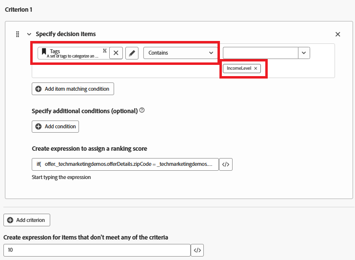

# Willekeurige formule maken

Bij het nemen van de biedingen wordt in Adobe Journey Optimizer een rangschikkingsformule gebruikt, met name in het kader van een selectiestrategie om de prioriteitsvolgorde van de in aanmerking komende aanbiedingen te bepalen. De rangschikkingsformule wordt toegepast na het filteren van de geschiktheid, wanneer meerdere aanbiedingen in aanmerking komen voor een bepaald profiel, maar alleen de bovenste (of weinige) aanbiedingen moeten worden gepresenteerd op basis van bedrijfslogica of profielcontext.

* Aanmelden bij Journey Optimizer

* Beslissing ->Strategie-instelling ->Beoordelingsformules ->Formule maken

Willekeurige formule


Een criterium in een rangschikkingsformule verwijst naar een voorwaardelijke regel die wordt gebruikt om een score aan een aanbieding toe te wijzen. Deze criteria vergelijken de kenmerken van de aanbieding en het profiel of de context om te bepalen hoe relevant een aanbieding voor een specifieke persoon is.


Criteria 1

Deze voorwaarde filtert besluitpunten (aanbiedingen) **om slechts** de aanbiedingen te omvatten die met &quot;IncomeLevel.&quot;worden geëtiketteerd
Deze gefilterde aanbiedingen gaan vervolgens door naar de volgende stap, zoals rangschikking of levering, op basis van extra logica die u definieert.



De volgende expressie wordt gebruikt om de waarderingsscore te maken

```pql
if(   offer._techmarketingdemos.offerDetails.zipCode = _techmarketingdemos.zipCode,   _techmarketingdemos.annualIncome / 1000 + 10000,   if(     not offer._techmarketingdemos.offerDetails.zipCode,     _techmarketingdemos.annualIncome / 1000,     -9999   ) )
```

Wat de formule doet

* Als de aanbieding dezelfde postcode heeft als de gebruiker, geef deze een zeer hoge score zodat deze als eerste wordt gekozen.

* Als de aanbieding helemaal geen postcode heeft (het is een algemene aanbieding), geef deze een normale score op basis van de inkomsten van de gebruiker.

* Als de aanbieding een andere postcode heeft dan de gebruiker, geef deze een zeer lage score zodat deze niet is geselecteerd.

Op deze manier is het systeem:

* Probeer altijd eerst een aanbieding voor ZIP-matching te tonen,

* Als er geen overeenkomst wordt gevonden, wordt een algemene aanbieding teruggestuurd en worden aanbiedingen voor andere ZIP-codes niet weergegeven.


Als een aanbiedingsitem aan geen van de filtercriteria voldoet (bijvoorbeeld niet de tag &quot;IncomeLevel&quot;), ontvangt de aanbieding een standaardwaarderingsscore van 10.


