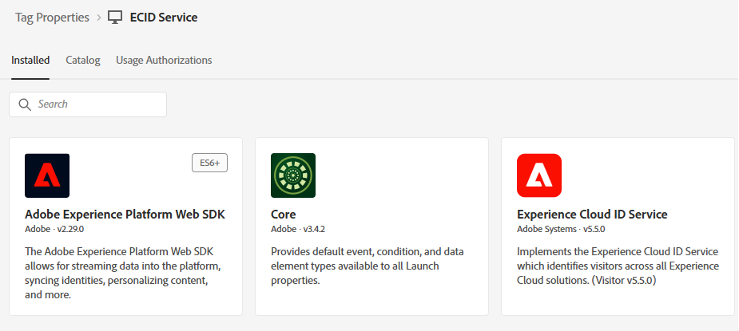

# Adobe Experience Platform-tags maken

Experience Platform-tags worden geconfigureerd op de webpagina om de Adobe Experience Platform Web SDK te laden, zodat de sendEvent API-aanroep gepersonaliseerde ervaringen kan activeren. Deze opstelling zorgt ervoor dat de noodzakelijke cliënt-zijbibliotheken correct worden geïnitialiseerd, die interactie in real time met Adobe Journey Optimizer voor aanbiedingslevering toestaan.

1. Meld u aan bij Gegevensverzameling.
1. Klik **[!UICONTROL Markeringen]** > **[!UICONTROL Nieuw Bezit]**.
1. Maak een Adobe Experience Platform-tag met de naam ECID Service.
1. Voeg de volgende extensies toe aan de tag:

   

1. Configureer de Adobe Experience Platform Web SDK voor het gebruik van de juiste omgeving en de DataStream voor financiële adviseurs die in de vorige zelfstudie is gemaakt

   

Geen extra configuratie nodig voor Adobe Client Data Layer en core extensions

## Het gegevenselement maken

Het ECID-gegevenselement in Experience Platform-tags wordt alleen gemaakt voor foutopsporing- en testdoeleinden. Met het gegevenselement kunnen ontwikkelaars de Experience Cloud-id weergeven die is toegewezen aan de browsersessie van een gebruiker. Zo kunnen identiteitsstitching worden gevalideerd en kan worden gecontroleerd of de `sendEvent` -aanroepen aan het juiste profiel zijn gekoppeld. Dit element wordt niet vereist voor personalisatie om te functioneren maar is nuttig tijdens implementatie en QA


## AEP-tags opnemen op de HTML-pagina

Stel de Adobe Experience Platform-tags samen en publiceer deze.

Wanneer een AEP-eigenschap Tags wordt gepubliceerd, geeft Adobe u een scripttag die u in uw HTML ``` <head>``` of onder aan de ``` <body>``` -tags moet plaatsen.

1. Ga naar de eigenschap Tags (ECID Service).

1. Klik op Omgevingen en klik vervolgens op het installatiepictogram van de gewenste omgeving (bijvoorbeeld Ontwikkeling, Staging, Productie).

1. Noteer de ingesloten code.

   Deze code moet vlak voor de afsluitende tag ```</body>``` op de HTML-pagina worden geplaatst.
