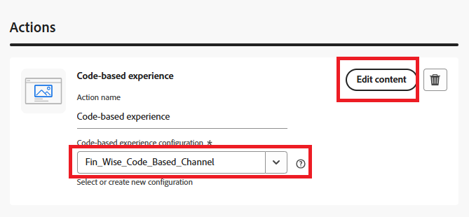

# Campagne maken

In Adobe Journey Optimizer (AJO) fungeert een campagne als een container waarin alle elementen zijn opgenomen die nodig zijn om persoonlijke ervaringen aan een doelgroep te kunnen bieden. Het organiseert wanneer en hoe aanbiedingen worden voorgesteld, die componenten zoals kanalen, plaatsen, inzamelingen, en besluitvormingsstrategieën verbinden.

* Aanmelden bij Journey Optimizer
* Reisbeheer ->Campagnes ->Campagne maken ->Marketing plannen
* Zorg ervoor om op code-gebaseerde ervaringsactie te selecteren en de configuratie te selecteren die in de vroegere stap wordt gecreeerd.
  
* Klik op Inhoud bewerken en vervolgens code bewerken om de verpersoonlijkingseditor te openen. Het is een interface voor het maken van een niet-visuele ervaring waarmee u uw code kunt ontwerpen
  
