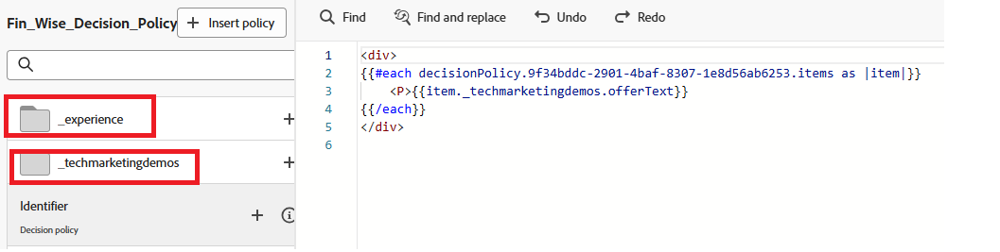

# Beslissingsbeleid maken

Het beleid van het besluit is containers voor uw aanbiedingen die hefboomwerking de [!UICONTROL &#x200B; Duidelijke &#x200B;] motor om de beste inhoud te kiezen te leveren, afhankelijk van het publiek.

1. In de verpersoonlijkingsredacteur, klik **punt van het beleid van de Beslissing** in de linkernavigatie, dan klik **[!UICONTROL besluitvormingsbeleid]** toevoegen.

   

1. Klik **[!UICONTROL toevoegen]** om de selectiestrategie te selecteren.

   

1. Klik **[!UICONTROL Uitgezochte reserve]** om de herfstaanbieding te selecteren.
1. Klik **[!UICONTROL daarna]** om het besluitvormingsbeleid te herzien.
1. Klik **[!UICONTROL creëren]** om het proces te voltooien om het besluitvormingsbeleid tot stand te brengen.

## Het beslissingsbeleid in de code-editor gebruiken

1. Van de verpersoonlijkingsredacteur, klik **[!UICONTROL beleid van het Tussenvoegsel]**.

   De code die overeenkomt met het beslissingsbeleid wordt toegevoegd.

   In dit stadium kunt u alle vereiste beslissingskenmerken rechtstreeks in de code opnemen. Deze kenmerken worden gedefinieerd in het schema dat wordt gebruikt in de catalogus met aanbiedingen. Standaardkenmerken worden geordend onder de naamruimte `__experience` , terwijl aangepaste kenmerken die specifiek zijn voor uw organisatie worden opgeslagen onder de naamruimte `_<imsOrg>` .

   

   Deze code doorloopt een lijst met persoonlijke aanbiedingen die voor de gebruiker zijn gekozen en geeft de tekst voor elke aanbieding op de webpagina weer. Het toont het bericht (genoemd `offerText`) van elke aanbieding binnen een paragraaf, zodat kunnen de gebruikers hun op maat gemaakte inhoud duidelijk zien.

   Als er geen persoonlijke aanbieding beschikbaar is, wordt een fallback-aanbieding weergegeven om ervoor te zorgen dat de ruimte niet leeg blijft.

1. Klik **[!UICONTROL sparen]**, dan activeer de campagne.
