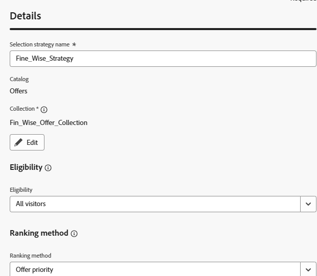

# Een selectiestrategie maken

Een selectiestrategie is een herbruikbare configuratie die een inzameling van aanbiedingen met toelatingsregels en een rangschikkingsmethode combineert om te bepalen welke aanbiedingen worden getoond wanneer de strategie in een besluitvormingsbeleid wordt gebruikt.

